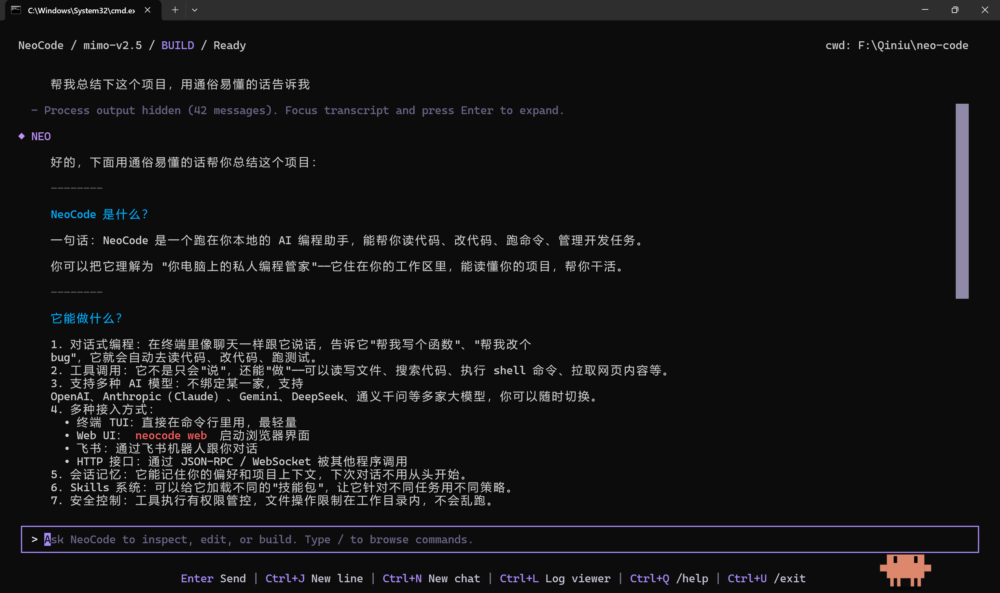
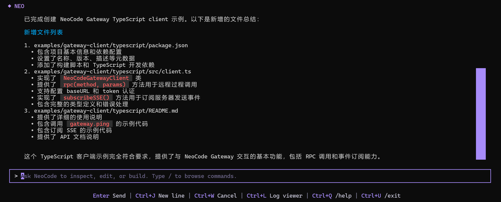

[中文](README.md) | [EN](README.en.md)

# 

> A local-first AI coding agent that helps you understand code, edit projects, call tools, and connect your development workflow across terminal, desktop, and automation.

<p align="center">
  <a href="https://go.dev/">
    
  </a>
  <a href="https://github.com/1024XEngineer/neo-code">
    
  </a>
  <a href="https://github.com/1024XEngineer/neo-code/blob/main/LICENSE">
    
  </a>
  <a href="https://neocode-docs.pages.dev/">
    
  </a>
  <a href="https://neocode-docs.pages.dev/en/guide/install">
    
  </a>
</p>


<p align="center">
  <a href="https://neocode-docs.pages.dev/en/">Docs</a>
  ·
  <a href="https://github.com/1024XEngineer/neo-code/issues">Issues</a>
  ·
  <a href="https://github.com/1024XEngineer/neo-code/discussions">Discussions</a>
</p>

---

## What Is NeoCode?

NeoCode is an AI coding agent that runs in your local development environment.

It can read your workspace, understand code, call tools, execute commands, manage sessions, and expose a unified local Gateway interface via JSON-RPC / SSE / WebSocket for terminal, desktop, or third-party clients.

Core loop:

`User Input (TUI) -> Gateway Relay -> Runtime Reasoning -> Tool Calls -> Result Feedback -> UI Rendering`

---

## Features

- Local-first: runs in your workspace with real project context.
- Terminal interaction: conversational coding-agent experience based on TUI.
- Tool calls: supports file access, project inspection, command execution, and system tools.
- Multi-provider support: OpenAI, Gemini, ModelScope, Qiniu, OpenLL, and custom providers.
- Session persistence: save and restore historical sessions to reduce repeated context switching.
- Memory: store preferences, project facts, and cross-session context.
- Skills system: enable specialized behaviors and workflows for different tasks.
- MCP integration: extend external tool capabilities through MCP stdio servers.
- Gateway mode: connect desktop apps, scripts, and third-party clients via local JSON-RPC / SSE / WebSocket.
- Web UI: launch browser-based interface with `neocode web` for visual chat and session management.
- Feishu Adapter: supports both Webhook and SDK long-connection access, with continuous run status updates in a single status card.
- Local Runner: `neocode runner` executes tools locally and actively connects to a cloud Gateway via WebSocket, with no inbound port required.

---

## Preview




More screenshots and interaction details:
- [Web UI Guide](https://neocode-docs.pages.dev/guide/web-ui)
- [Feishu Remote Setup](https://neocode-docs.pages.dev/guide/feishu-remote-setup)

---

## Quick Start

### 1. Install

macOS / Linux:

```bash
curl -fsSL https://raw.githubusercontent.com/1024XEngineer/neo-code/main/scripts/install.sh | bash
```

Windows PowerShell:

```powershell
irm https://raw.githubusercontent.com/1024XEngineer/neo-code/main/scripts/install.ps1 | iex
```

### 2. Run from source

```bash
git clone https://github.com/1024XEngineer/neo-code.git
cd neo-code
go run ./cmd/neocode
```

### 3. Configure API key

Set the environment variable for your selected provider, for example:

```bash
export OPENAI_API_KEY="your_key_here"
```

Windows PowerShell:

```powershell
$env:OPENAI_API_KEY = "your_key_here"
```

Then start in your project directory:

```bash
neocode --workdir /path/to/your/project
```

If you want to use the browser-based Web UI, run:

```bash
neocode web
```

Tagged release builds already embed Web UI assets (`web/dist`) into the `neocode` binary, so running `neocode web` does not require Node.js or npm on the target machine. If you run from source with `go run ./cmd/neocode web`, NeoCode will still automatically try to build the frontend when `web/dist` is missing.

### 4. Quick Web / Feishu Entry

```bash
# Browser Web UI (default 127.0.0.1:9090)
neocode web

# Specify Web UI listen address (for local debugging)
neocode web --http-listen 127.0.0.1:9090 --skip-build

# Feishu SDK mode (recommended, no public ingress required)
neocode feishu-adapter --ingress sdk --gateway-listen "127.0.0.1:8080"

# Feishu Webhook mode (requires callback-reachable address from Feishu)
neocode feishu-adapter --ingress webhook --gateway-listen "127.0.0.1:8080" --listen "127.0.0.1:18080"
```

Detailed guides:
- [Web UI Guide](https://neocode-docs.pages.dev/guide/web-ui)
- [Feishu Remote Setup (SDK / Webhook)](https://neocode-docs.pages.dev/guide/feishu-remote-setup)

### 5. Common commands

```text
/help                 Show help
/provider             Switch provider
/model                Switch model
/compact              Compact current session context
/memo                 Show memory
/remember <text>      Save memory
/skills               List available skills
/skill use <id>       Enable a skill
/skill off <id>       Disable a skill
```

### 6. CLI Routing Quick Reference

#### Provider management

Use these commands to add, list, and remove custom providers. Changes are stored under `~/.neocode/providers/`.

```bash
# Add a custom provider (ensure --api-key-env points to an existing environment variable)
neocode provider add <name> --driver <driver> --url <url> --api-key-env <env> [--discovery-endpoint <path>]

# Example
export MOCK_KEY="sk-xxx"
neocode provider add my-openai --driver openaicompat --url https://api.openai.com/v1 --api-key-env MOCK_KEY --discovery-endpoint /v1/models

# List all providers
neocode provider ls

# Remove a custom provider
neocode provider rm my-openai
```

#### Model selection

Use these commands to list model candidates for the current provider and switch to a specific model.

```bash
# List available models for the current provider (prefer local snapshot; trigger one sync discovery only when needed)
neocode model ls

# Set current model (validates model ownership against the current provider)
neocode model set <model-id>

# Example
neocode model set gpt-4.1
```

#### One-step provider + model switch

Use this flow to switch provider, and optionally override the auto-selected model via `--model`.

```bash
# Switch provider only (auto-corrects to an available model)
neocode use <provider>

# Switch provider and set model (with provider-model ownership validation)
neocode use <provider> --model <model-id>

# Example
neocode use openai --model gpt-4.1
```

#### Local Runner

Start a local execution daemon that actively connects to a cloud Gateway and receives tool-execution requests.

```bash
# Start runner (connects to 127.0.0.1:8080 by default)
neocode runner

# Set remote Gateway address and token
neocode runner --gateway-address "your-gateway.com:8080" --token-file ~/.neocode/auth.json

# Set runner name and working directory
neocode runner --runner-name "My Local Machine" --workdir /path/to/project
```

### 7. Shell Diagnostic Agent

Use these commands to enter proxy shell mode, initialize shell integration, trigger manual diagnosis, and manage automatic diagnosis.

```bash
# Enter proxy shell (currently Unix-like only)
neocode shell

# Print shell integration script (also supports --init <shell>)
neocode shell --init bash
neocode shell --init zsh

# Trigger one manual diagnosis (both forms are equivalent)
neocode diag
neocode diag diagnose

# Enter IDM interactive diagnostic sandbox (exit with "exit" or Ctrl+C when idle)
neocode diag -i

# Automatic diagnosis switch and status
neocode diag auto on
neocode diag auto off
neocode diag auto status
```

### 8. URL Scheme Usage

Detailed guide: [HTTP URL Wake-up Guide (User Story Version)](https://neocode-docs.pages.dev/guide/http-daemon-wake-user-guide)

```bash
# Start local HTTP daemon (default: 127.0.0.1:18921)
go run ./cmd/neocode daemon serve

# Install user-level autostart + best-effort hosts alias write (127.0.0.1 neocode)
go run ./cmd/neocode daemon install

# Check running and installation status
go run ./cmd/neocode daemon status

# Uninstall autostart configuration
go run ./cmd/neocode daemon uninstall
```

Clickable URL examples:

```text
http://neocode:18921/review?path=README.md
http://neocode:18921/run?prompt=Write%20a%20simple%20HTTP%20server
```

> Currently supported actions:
> - `review`: requires the `path` parameter.
> - `run`: requires the `prompt` parameter. Gateway returns `session_id` and triggers terminal handoff.

Session handoff startup:

```bash
go run ./cmd/neocode --session <session_id>
```

> When `--session` is provided, TUI first attempts context handoff using the `workdir` saved in session history. If that path is no longer valid locally, NeoCode keeps the current workspace and displays a warning.
>
> On Linux (and other non-Windows/macOS platforms), automatic terminal popup is not yet integrated. `wake.run` returns `not_supported`, and you can manually run `neocode --session <session_id>` for handoff.
>
> `daemon serve` does not provide `--token-file`, listens only on `127.0.0.1`, and limits Host allowlist to `neocode` / `localhost` / `127.0.0.1`.
>
> Linux autostart strategy: prefer `systemd --user`; fall back to `~/.config/autostart/neocode-daemon.desktop` when unavailable.
>
> If NeoCode was not installed via install script (for example, built from source or using a bare binary), run `neocode daemon install` manually once.

---

## Documentation Map (By Scenario)

Official docs site (English): [https://neocode-docs.pages.dev/en/](https://neocode-docs.pages.dev/en/)

Recommended reading path:

1. First-time setup
- [Installation Guide](https://neocode-docs.pages.dev/guide/install)
- [Daily Use Guide](https://neocode-docs.pages.dev/guide/daily-use)
- [Configuration Guide](https://neocode-docs.pages.dev/guide/configuration)

2. Entry surfaces (Web / Feishu)
- [Web UI Guide](https://neocode-docs.pages.dev/guide/web-ui)
- [Feishu Remote Setup (SDK / Webhook)](https://neocode-docs.pages.dev/guide/feishu-remote-setup)
- [HTTP URL Wake-up Guide](https://neocode-docs.pages.dev/guide/http-daemon-wake-user-guide)

3. Extensibility (MCP / Skills / Hooks)
- [MCP Integration](https://neocode-docs.pages.dev/guide/mcp)
- [Skills Guide](https://neocode-docs.pages.dev/guide/skills)
- [Hooks Guide](https://neocode-docs.pages.dev/guide/hooks)
- [Tools and Permissions](https://neocode-docs.pages.dev/guide/tools-permissions)

4. Protocol and internals
- [Gateway Integration & Protocol (Reference)](https://neocode-docs.pages.dev/reference/gateway)
- [Runtime / Provider Event Flow (Repo Doc)](docs/runtime-provider-event-flow.md)

5. Maintenance and troubleshooting
- [Update Guide](https://neocode-docs.pages.dev/guide/update)
- [Troubleshooting](https://neocode-docs.pages.dev/guide/troubleshooting)

Docs site source is under `www/`. Local preview:

```bash
cd www
pnpm install
pnpm docs:dev
```

---

## Contributing

Contributions via Issues, Discussions, and Pull Requests are welcome.

Suggested workflow:

1. Describe your problem, requirement, or design idea in an Issue first.
2. Fork the repository and create a feature branch.
3. Keep your changes focused and explain motivation and impact clearly.
4. Run baseline checks before submitting:

```bash
gofmt -w ./cmd ./internal
go test ./...
go build ./...
```

---

## License

MIT
