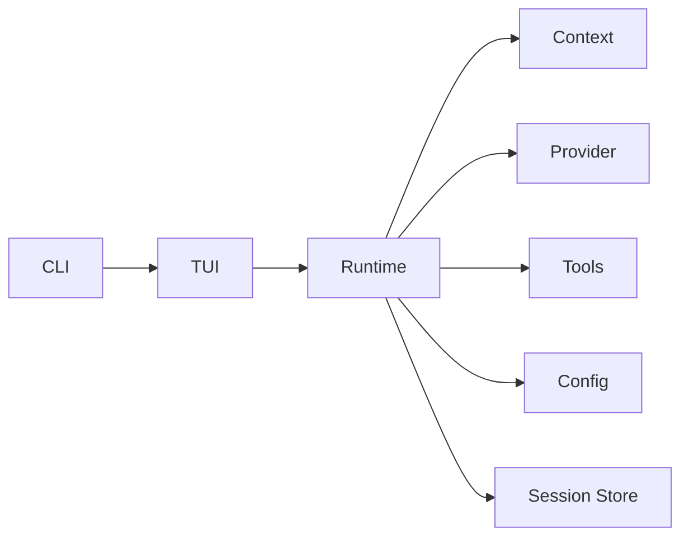
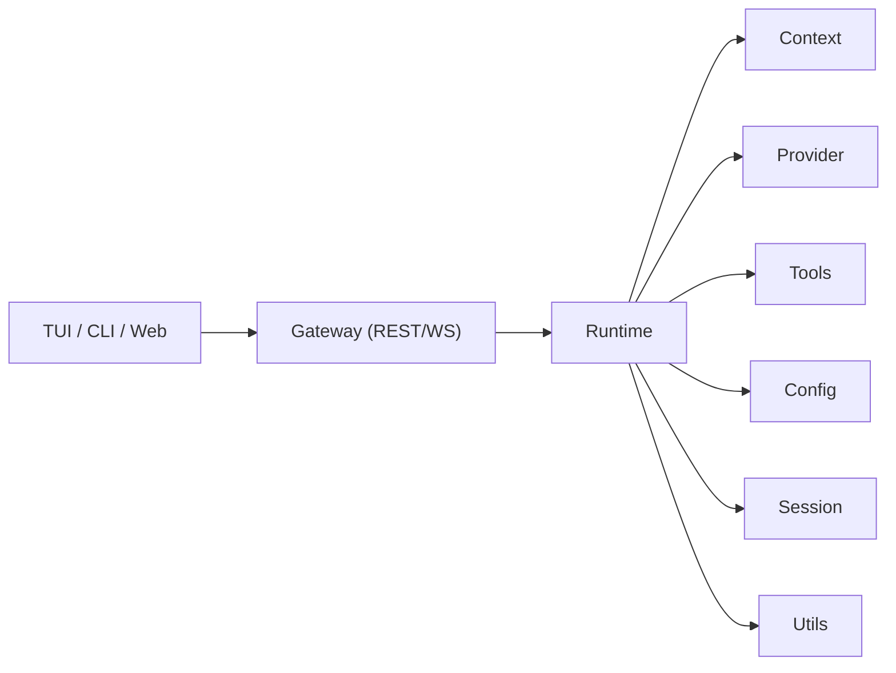

# NeoCode 架构文档

> 状态：v2.0.0-draft.2  
> 目录：`docs/architecture`  
> 目标：以模块化文档（`README.md + interface.go`）作为唯一架构事实源。

## 标签约定

- `[CURRENT]`：当前仓库已实现且可联调。
- `[PROPOSED]`：目标态设计。
- `[NOT IMPLEMENTED YET]`：明确未落地，不可按当前行为依赖。

## 总体架构

### [CURRENT] 当前主链路

### [PROPOSED][NOT IMPLEMENTED YET] 目标入口

## 模块清单

| 模块 | 文档 | 契约 | 当前状态 |
|---|---|---|---|
| Runtime | [runtime/README.md](./runtime/README.md) | [runtime/interface.go](./runtime/interface.go) | `[CURRENT]` |
| Context | [context/README.md](./context/README.md) | [context/interface.go](./context/interface.go) | `[CURRENT]` |
| Provider | [provider/README.md](./provider/README.md) | [provider/interface.go](./provider/interface.go) | `[CURRENT]` |
| Tools | [tools/README.md](./tools/README.md) | [tools/interface.go](./tools/interface.go) | `[CURRENT]` |
| Config | [config/README.md](./config/README.md) | [config/interface.go](./config/interface.go) | `[CURRENT]` |
| TUI | [tui/README.md](./tui/README.md) | [tui/interface.go](./tui/interface.go) | `[CURRENT]` |
| CLI | [cli/README.md](./cli/README.md) | [cli/interface.go](./cli/interface.go) | `[CURRENT]` |
| Gateway | [gateway/README.md](./gateway/README.md) | [gateway/interface.go](./gateway/interface.go) | `[PROPOSED]` |
| Session | [session/README.md](./session/README.md) | [session/interface.go](./session/interface.go) | `[CURRENT]` |
| Utils | [utils/README.md](./utils/README.md) | [utils/interface.go](./utils/interface.go) | `[PROPOSED]` |

## 阅读顺序

1. 先读 `runtime`、`session`，建立主编排与持久化基线。
2. 再读 `context`、`provider`、`tools`、`config`，理解核心依赖边界。
3. 再读 `tui`、`cli`、`gateway`，理解入口层与协议层演进。

## 约束

- 本目录中的 `interface.go` 用于架构契约表达，不参与生产代码实现。
- 未落地能力必须显式标注 `[PROPOSED]` 或 `[NOT IMPLEMENTED YET]`。
- 文档中的接口命名优先对齐当前项目已存在命名。
