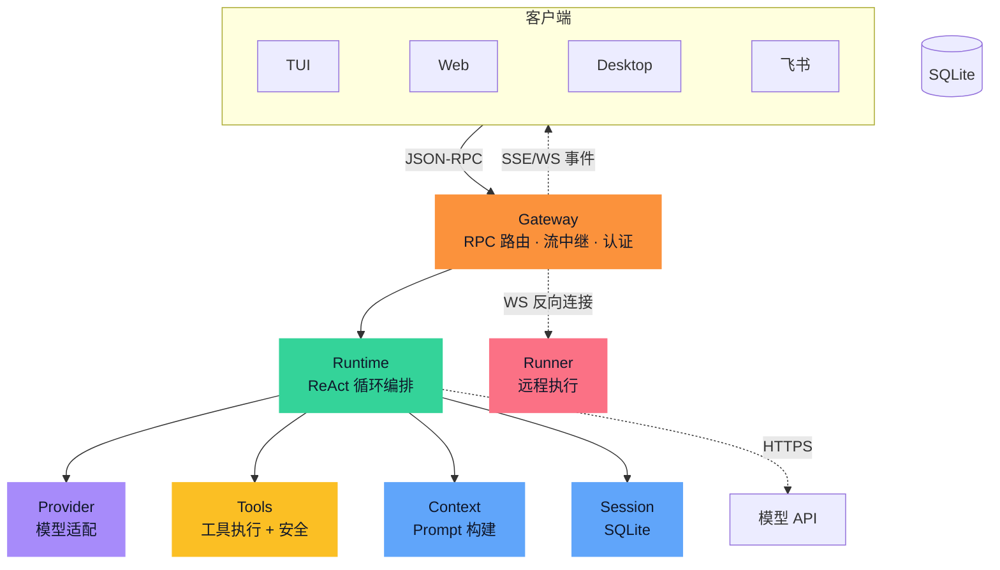

# NeoCode 构架设计分析（聚焦核心决策版 - By fanfeilong）

**版本：** 核心决策草案  
**来源参考：** `architecture-v3.remote.md`  
**定位：** 解释 NeoCode 为什么必须长成这样，而不是罗列当前实现模块。

---

## 1. 系统驱动

NeoCode 的比较对象不是单次 LLM 会话，而是 Claude Code、Codex 这类已经具备 Agent Loop、工具调用和代码修改能力的 AI Coding 工具。  
因此本文不把“能多轮调用工具”当成差异化理由；那是入场券，不是架构说服力。

NeoCode 真正要回答的是：在已有 AI Coding 工具存在的情况下，为什么还需要一个本地优先、多端对等、模型中立、可审计可恢复的 Agent 架构。

| 场景压力 | 系统必须 | 否则 |
|----------|----------|------|
| 用户需要掌握代码、会话、密钥和恢复点 | 把核心状态留在用户控制环境内 | Agent 变成云端或厂商控制面的一部分 |
| 同一个 Agent 能力要被 TUI、Web、Desktop、IM、脚本共享 | 提供统一控制入口 | 每个入口形成不同状态、权限、事件和审批语义 |
| 工具、MCP、远程执行都会产生真实副作用 | 建立统一副作用安全边界 | 安全策略随工具和客户端分裂，审计无法闭合 |
| 模型市场和厂商能力变化很快 | 隔离模型协议、流式格式和错误语义 | 系统核心被某个模型 API 绑定 |
| 用户希望远程触发工作区执行，但不暴露机器 | 使用受限能力的反向远程执行 | 远程能力退化成开放端口或通用 Shell |
| 长任务需要跨轮次恢复和解释 | 持久化任务过程、审批、工具结果和恢复点 | 出错后无法追踪、无法回滚、无法解释 |

---

## 2. 系统构架（Overview）

以下 overview 图保留自 v3 架构文档，用来说明当前系统形态。  
核心决策版不按图中的组件逐个展开，而是解释这些组件背后的构架必然性。



这张图的关键不是组件数量，而是控制方向：

- 客户端只进入统一控制入口。
- 任务循环统一推进模型、工具、上下文和状态。
- 模型只产生推理事件和行动意图。
- 工具边界负责把行动意图变成受控副作用。
- 状态边界记录会话、审计和恢复事实。
- 远程执行端是受限能力，不是通用 Shell。

---

## 3. 核心构架决策

| 优先级 | 核心决策 | Why | 如果不这样 | 代价 |
|--------|----------|-----|------------|------|
| P0 | 本地控制权 | NeoCode 的前提是用户掌握代码、会话、密钥、审批和恢复点 | 系统会退化成依赖厂商或云端控制面的 Agent | 需要承担本地状态、一致性和数据生命周期 |
| P0 | 统一副作用安全边界 | 文件、Shell、MCP、远程执行的风险必须用同一套裁决和审计覆盖 | 工具越多，安全语义越分裂，审批和恢复点无法闭合 | 所有工具接入都必须声明能力、校验参数、接受裁决 |
| P1 | 统一控制入口 | 多端是同一 Agent 能力的不同入口，不应产生多套任务事实 | TUI、Web、IM、脚本各自形成状态、取消、审批和事件语义 | 控制入口成为关键路径，必须轻量少状态 |
| P1 | 模型中立边界 | NeoCode 不能被某个模型厂商的协议和能力形态绑定 | 切换模型会影响任务循环、工具语义和客户端行为 | 厂商高级能力需要先抽象后进入核心 |
| P1 | 可恢复任务事实 | 长任务必须能解释读了什么、改了什么、谁批准了什么、为什么结束 | 会话中断不可恢复，AI 修改不可回滚，事故无法追踪 | 需要持久化过程、审批、工具结果和恢复点 |
| P2 | 受限反向远程执行 | 远程触发工作区执行不能要求用户暴露机器，也不能变成通用 Shell | 需要开放入站端口，或形成过宽远程执行能力 | 需要管理连接、心跳、能力范围和过期 |
| 基础能力 | 任务循环 | Agent Loop 是 AI Coding 工具的基本内核，用于承载推理、行动、观察和验收 | 没有它就不是完整 Coding Agent | 它不是 NeoCode 的差异化重点，但必须稳定、可暂停、可验收 |

---

## 4. 构架（中文伪代码）

下面不是实现方案，而是 NeoCode 的构架语义。

```text
当客户端发来请求：
    确认身份
    判断是否有权执行这个控制动作

    如果请求不合法：
        拒绝，并记录原因

    如果请求合法：
        创建或恢复任务
        发布“任务开始”
        交给任务循环推进
```

```text
任务循环持续推进，直到出现明确终态：
    构建模型上下文
    调用模型继续推理

    如果模型输出文本：
        发布为进度事件

    如果模型提出行动意图：
        交给工具副作用边界
        把执行结果或拒绝原因写回任务
        进入下一轮

    如果模型给出候选最终答案：
        做完成度检查和必要验证

        如果验收通过：
            保存最终答案，发布“任务完成”

        如果还有可修复缺口：
            把缺口证据写回任务，进入下一轮

        如果失败、无法继续、被取消或超过限制：
            保存终止原因，发布“任务停止”
```

```text
处理模型提出的行动意图：
    检查行动格式
    判断副作用类型和目标范围
    根据主体、会话、工具、目标、风险和权限指纹做安全裁决

    如果拒绝：
        不执行，把拒绝原因返回任务循环

    如果需要审批：
        暂停任务，向客户端发出权限请求
        等待人类允许或拒绝

    如果允许执行：
        对高风险修改先创建恢复点
        执行工具行动
        记录输入、输出、审批和审计事实
        把工具结果返回任务循环
```

关键点：

- 多端请求进入同一控制面。
- 任务循环承载 Agent 的基础执行语义。
- 模型意图必须经过副作用边界。
- 最终答案必须经过系统验收。

---

## 5. 运行机制

用户输入任务  
→ 统一控制入口认证和授权  
→ 任务循环构建上下文  
→ 模型产生文本或行动意图  
→ 行动意图进入工具副作用边界  
→ 安全裁决决定允许、拒绝或请求审批  
→ 工具结果或拒绝证据回灌任务循环  
→ 系统验收候选答案  
→ 完成、继续、失败或无法完成  

运行机制的重点不是证明 Agent Loop 存在，而是保证同一条循环同时受统一控制入口、副作用安全边界、本地状态和模型中立边界约束。

---

## 6. 失败路径

| 缺失或错误设计 | 结果 |
|----------------|------|
| 没有本地控制权 | 状态、密钥、审批和恢复点落入外部控制面，NeoCode 失去本地优先前提 |
| 没有统一副作用安全边界 | 工具、MCP、远程执行各自定义风险语义，审批和审计无法闭合 |
| 没有统一控制入口 | 多端状态、审批、取消、事件和鉴权语义分裂 |
| 没有模型中立边界 | 模型厂商差异进入核心逻辑，切换模型影响全系统 |
| 没有可恢复任务事实 | 会话不可恢复，AI 修改不可回滚，审计链断裂 |
| 远程执行设计成通用 Shell | 能力过宽，攻击面扩大，用户机器暴露不必要风险 |
| 任务循环不可暂停或不可验收 | 审批、取消、失败回灌和系统验收只能散落在临时逻辑中 |

---

## 7. 构架核心总结

NeoCode 的关键不在于“比单次 LLM 会话多一层工具调用”。成熟 AI Coding 工具都已经具备 Agent Loop。  
NeoCode 的核心在于把 Agent Loop 放进一组更强的控制约束里：

| 抽象 | 作用 |
|------|------|
| 本地控制权 | 用户掌握代码、状态、密钥、审批和恢复点 |
| 统一副作用安全边界 | 工具、MCP、远程执行共享同一裁决和审计语义 |
| 统一控制入口 | 多端共享同一任务事实和控制语义 |
| 模型中立边界 | 模型变化不能污染核心任务语义 |
| 可恢复任务事实 | 执行过程可追踪、可解释、可回滚 |
| 受限远程执行 | 跨机器执行不退化为开放机器或通用 Shell |
