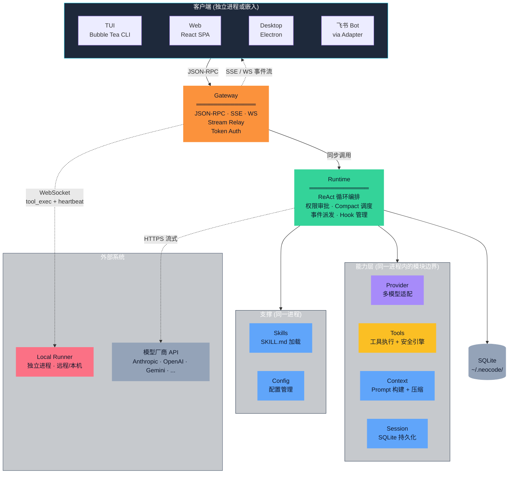
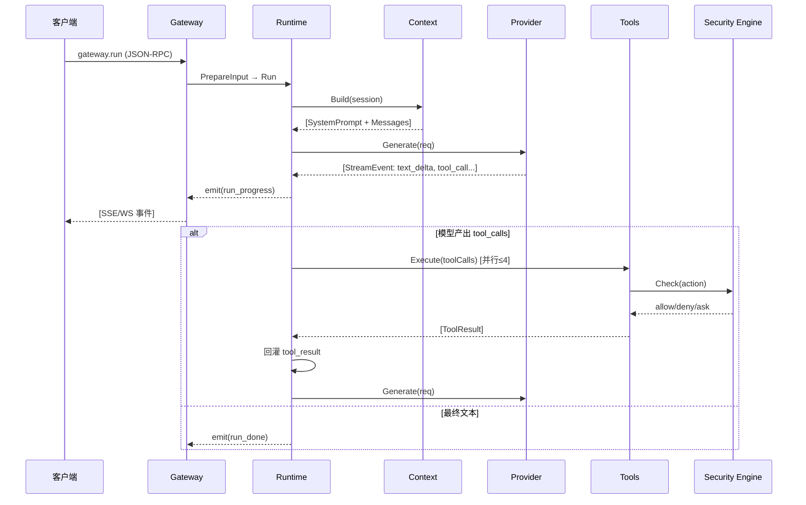
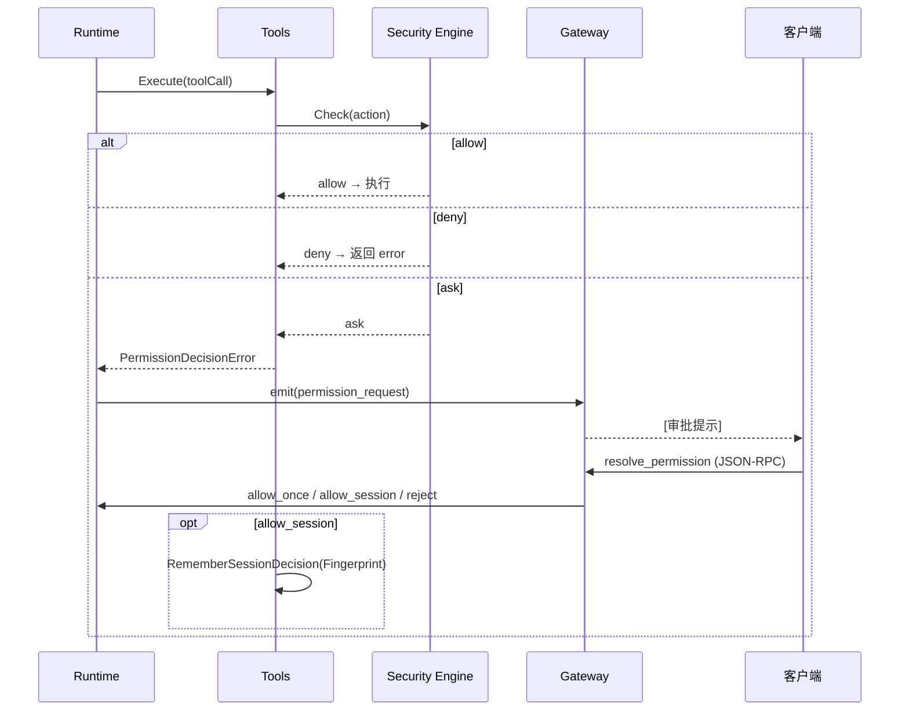
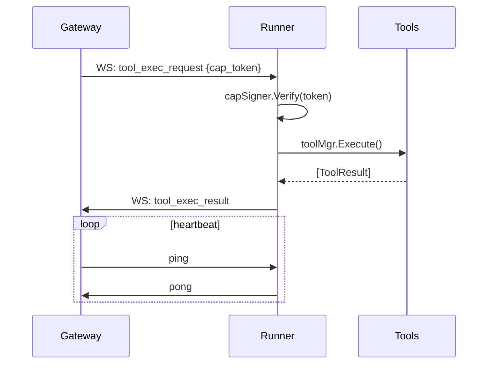

# NeoCode 系统架构

**v2.0** | 2026-05-09 | 目标读者：团队成员、项目贡献者

本文档描述 NeoCode 的架构边界、核心组件、关键路径和安全约束。API 字段、部署步骤、详细设计和实现细节见 [相关文档索引](#13-相关文档索引)。

// 开头应该有完整的Purpose，提供给阅读者作为引入。

---

## 1. 架构驱动力

六条硬约束决定了全部架构决策。

| # | 驱动力 | 强制的选择 |
|---|--------|-----------|
| D1 | **本地优先** — 代码和会话数据不出用户机器 | 零依赖单二进制；SQLite 嵌入式持久化；离线可用 |
| D2 | **多端对等接入** — TUI/Web/Desktop/IM/CI 都是对等客户端 | Gateway 唯一 RPC 边界；JSON-RPC 协议；适配器模式 |
| D3 | **多模型可替换** — 厂商差异不向上泄漏 | Provider 插件化（2 方法接口）；上层零改动接入新模型 |
| D4 | **工具执行可控** — 文件/Bash/网络操作需审计和审批 | Security Engine 关键路径；WorkspaceSandbox；Checkpoint 回滚 |
| D5 | **Human-in-the-Loop** — 危险操作需人类确认 | 事件驱动暂停-恢复循环；PolicyEngine ask/allow/deny |
| D6 | **单机零运维** — 用户不是 DBA 或 SRE | 核心模块同进程；SQLite；自动过期清理 |

// 过分结构化，生硬的凝练导致信息失真。对于设计原则，应该有基本的文字描述。

// 示例（参考其它开源项目的架构文档）：

// - Maximize parallelism

// Most of the time should be spent doing fully parallelizable work. This can be observed by taking a CPU trace using the --trace=[file] flag and viewing it using go tool trace [file].

// - Avoid doing unnecessary work

// For example, many bundlers have intermediate stages where they write out JavaScript code and read it back in using another tool. This work is unnecessary because if the tools used the same data structures, no conversion would be needed.

---

## 2. 系统边界

### 2.1 In Scope

| 职责域 |
|--------|
| 多模型 Provider 归一化（流式推理 + Token 估算） |
| ReAct 推理循环（上下文构建 → 推理 → 工具调用 → 结果回灌） |
| 工具执行（文件/Bash/Git 语义/Codebase/WebFetch/MCP/Todo/Memo/子代理/诊断） |
| 多端接入（TUI/Web/Desktop/飞书/CI 通过 Gateway JSON-RPC/SSE/WS） |
| 会话管理（SQLite 持久化、Token 追踪、Compact 压缩） |
| Skills/MCP 扩展；Memo 跨会话记忆；Checkpoint 本地快照；自我更新 |

### 2.2 Out of Scope

| 不在范围内 | 边界说明 |
|-----------|----------|
| 中心化云端 SaaS / 多租户 | 数据全在本地，权限继承系统进程 |
| 单一模型厂商绑定 | Provider 接口开放，可切换任意模型或本地部署 |
| 全自动黑盒程序员 | 危险操作必须经 Human-in-the-Loop 审批 |
| 重型 IDE 插件 / fork | 不 Fork 编辑器；可嵌入瘦客户端复用 Gateway |
| 强依赖公网的 Web 客户端 | 离线局域网下直连本机 Gateway |
| 远程代码托管 | 有本地 Checkpoint，不替代 GitHub/GitLab |
| 自研大模型 | Agent 框架，不训练模型 |
| 组织级 RBAC | 鉴权限于 Gateway 连接级 Token |

// #2.1，#2.2的问题同 #1。纯表格+关键句无法阐述清楚事物属性。

### 2.3 外部系统

```
客户端（TUI / Web / Desktop / 飞书 Bot / CI）──RPC──▶ Gateway ──▶ Runtime ──▶ Provider ──▶ 模型 API (HTTPS)
                                                    │              │
                                                    │              ├──▶ Tools ──▶ Shell / FS / Git / MCP / Web
                                                    │              │
                                                    │              └──▶ Session ──▶ SQLite
                                                    │
                                                    └──▶ Runner (WS 反向连接)
```

// 为什么要在这里讲系统边界？作为对架构不熟悉的潜在贡献者，我会对文档说的这些感到迷茫。

---

## 3. 架构总览

### 3.1 容器图



// 基本的文字描述在哪里？

// 参考：

// Overview

// [image]

// The build pipeline has two main phases: scan and compile. These both reside in [bundler.go](https://github.com/evanw/esbuild/blob/main/internal/bundler/bundler.go).

// Scan phase

// This phase starts with a set of entry points and traverses the dependency graph to find all modules that need to be in the bundle. This is implemented in `bundler.ScanBundle()` as a parallel worklist algorithm. The worklist starts off being the list of entry points. Each file in the list is parsed into an AST on a separate goroutine and may add more files to the worklist if it has any dependencies (either ES6 `import` statements, ES6 `import()` expressions, or CommonJS `require()` expressions). Scanning continues until the worklist is empty.

// Compile phase

// This phase creates a bundle for each entry point, which involves first "linking" imports with exports, then converting the parsed ASTs back into JavaScript, then concatenating them together to form the final bundled file. This happens in `(*Bundle).Compile()`.

### 3.2 核心架构选择

| 设计张力 | 选择 | 代价 | 详见 |
|----------|------|------|------|
| 微服务 vs 单体 | **强边界单体**（同进程 interface 解耦） | 无法独立扩缩容 | ADR-004 |
| 同步 vs 事件驱动 | **进程内事件驱动**（Go channel） | 客户端需支持 SSE/WS 长连接 | ADR-003 |
| Go vs Python/TS/Rust | **Go 单二进制** | AI SDK 生态不如 Python 丰富 | ADR-004 |
| SQLite vs 外部 DB | **SQLite（modernc）** | 单 writer，同会话写串行化 | ADR-005 |
| JSON-RPC vs gRPC/REST | **JSON-RPC 2.0 + SSE/WS** | 无强类型 schema | ADR-006 |

// 问题同 #1。我不能明白这些术语具体指的是什么，以及为什么这样选择架构。

---

## 4. 组件

每个组件的核心问题：**存在理由、拥有的决策权、不能知道什么、禁止做什么。**

| 组件 | 职责 | 决策权 | 不能知道 | 禁止 |
|------|------|--------|----------|------|
| **Gateway** | 唯一 RPC 入口：认证、路由、流中继 | 接受哪个连接、允许哪个 method、事件路由到哪个客户端 | 客户端实现细节、模型厂商字段、工具逻辑 | 不内嵌客户端特化逻辑；不直接执行工具或调 Provider |
| **Runtime** | ReAct 循环编排："指挥不执行" | 循环何时继续/终止、Compact 何时触发、权限审批暂停/恢复 | 厂商协议、工具实现、Prompt 组装细节、传输协议 | 不直接执行工具；不读厂商原始响应；不直连客户端 |
| **Provider** | 厂商 API 归一化为 `Generate()` + `EstimateTokens()` | 如何映射厂商格式到统一 StreamEvent | 上层模块（单向依赖：仅被 Runtime 调用） | 厂商特定字段不向上穿透 |
| **Tools** | 所有模型可调用的能力入口 + Security Engine 关键路径 | 暴露哪些 Schema、每次调用是否允许 | 推理循环状态、当前模型、客户端身份 | 不可跳过 Security Engine |
| **Session** | 会话数据的唯一持有者 | 何时创建/追加/过期/裁剪 | 推理状态、Prompt 逻辑 | 同会话并发写必须串行化 |
| **Context** | Prompt 组装 + Compact 压缩 | 组装顺序、压缩级别、哪些消息不可压缩 | 厂商协议、工具结果 | System Prompt 和 Pin 消息不可参与压缩 |
| **Skills** | SKILL.md 加载 + 会话级激活 | 哪些 Skill 可用、哪个会话激活哪个 | — | project 层覆盖 global 层（同名去重） |
| **Runner** | 远程工具执行代理（可跨物理机） | 是否接受执行请求（CapToken + Allowlist） | — | 不开放入站端口；反向连 Gateway |
| **Config** | 配置加载、校验、热更新 + Provider 选择状态 | 当前生效配置；runtime 模型选择 | — | 密钥不入配置文件（仅存环境变量名） |

// 过分结构化将语义拆散。阅读者没有办法从表格中得到完整的信息流。

---

## 5. 运行时流程

### 5.1 Run Flow（ReAct 主循环）



### 5.2 Permission Flow



### 5.3 Runner Flow



// 我们能清楚调用信息，但是调用的理由和结果是什么？

---

## 6. 状态与数据归属

| 数据 | 归属组件 | 存储 | 生命周期 |
|------|----------|------|----------|
| 消息历史、Token 计数 | Session | SQLite `messages` | 单会话 ≤8192 条；30 天过期 |
| 会话头（模型/模式/Todo/Plan/Skills） | Session | SQLite `sessions` | 同会话 |
| Checkpoint 快照 | Session | SQLite `checkpoint_records` | Run 内保留；自动修剪 |
| 权限记忆 | Session | SQLite `session_permission` | 跟随会话 |
| 配置 + Provider 选择 | Config | `~/.neocode/config.yaml` | 持久，手动修改 |
| 运行时推理状态 | Runtime | 内存 | Run 生命周期 |
| Prompt 模板 | Context | 嵌入二进制 + 文件系统 | 随版本 |

// 作为潜在贡献者，我第一眼不明白这个表格是用来做什么的？“谁拥有什么状态、状态如何持久化、哪些状态是临时的”没有作为关键表头或简单说明表述出来。这些状态又是做什么的？

**关键不变量的实现：**

| 不变量 | 机制 |
|--------|------|
| 同会话并发写串行 | `sessionLock`（per-session mutex） |
| Compact 原子替换 | SQLite 事务：`ReplaceTranscript()` |
| Checkpoint 原子创建 | SQLite 事务：record → session_cp → status update |
| 配置线程安全 | `Manager.mu`（RWMutex）+ copy-on-read |

**Checkpoint 状态机：** `creating → available → restored / pruned`（`broken` 为异常分支）

**权限状态机：** `SecurityCheck → allow / deny / ask → WaitUser → allow_once / allow_session / reject`

---

## 7. 安全边界

四层纵深防御。关键控制点逐层收紧。

// 到底是给领导说的还是给同学看的？

```
客户端 ──▶ [1] Gateway Auth (Token → subject_id)
               │
               ▼
          [2] Gateway ACL (method × source 白名单)
               │
               ▼
          [3] Security Engine (PolicyEngine + WorkspaceSandbox)
               │
               ▼
          [4] OS 约束（进程权限 = 当前用户）
```

| 控制点 | 机制 | 核心行为 |
|--------|------|----------|
| **认证** | `gateway.authenticate` → Token → `subject_id` | 无 Authenticator 时授予 `local_admin`（本地 loopback 场景） |
| **ACL** | method × source 白名单 | 未允许的 method 返回 `acl_denied` |
| **策略引擎** | PolicyRule 按 Priority 匹配 | `allow` → 执行；`deny` → 拒绝；`ask` → 暂停等用户审批 |
| **工作区沙箱** | 路径解析 + 边界校验 | 阻断 `../` 穿越；检测 Symlink 逃逸；越界生成 safe 候选 |
| **敏感路径** | 关键词 + 文件名模式自动检测 | `.env`/`.ssh`/密钥文件/私钥文件 → 强制 `deny` |
| **密钥保护** | `api_key_env` 仅存环境变量名 | 密钥不入配置文件、不入日志、不经 Gateway 传输 |
| **回滚安全网** | Checkpoint 写前快照 | `pre_write`/`end_of_turn`/`compact` 自动触发 |
| **Runner 隔离** | Capability Token（HMAC-SHA256） | 限定工具列表 + 路径范围 + 有效期 |

---

## 8. 部署视图

| 产物 | 目标 OS/Arch | 包含能力 |
|------|-------------|----------|
| `neocode` | Linux/macOS/Windows amd64+arm64 | CLI、TUI、Gateway、Daemon、Runner、Web UI |
| `neocode-gateway` | 同上 | 独立 Gateway（服务器常驻） |

**部署拓扑：**

- **单机：** TUI/Web/Desktop →（loopback RPC）→ Gateway（同进程或 Daemon） → Runtime → SQLite
- **分布：** 远程客户端 → Gateway（云/服务器）→ WebSocket ← Runner（工位 NAT 后，主动连接）

---

## 9. 可观测性

| 维度 | 机制 |
|------|------|
| **追踪** | `SessionID + RunID` 贯穿全链路（Client → Gateway → Runtime → Provider → Tools） |
| **事件流** | 所有运行时事件（text_delta、tool_call、permission_request、usage）经 `RuntimeEvent` channel 发出 |
| **指标** | 5 个 Prometheus 指标（requests、auth_failures、acl_denied、connections_active、stream_dropped）+ `/metrics` + `/metrics.json` |
| **健康检查** | `/healthz` 存活探针；`gateway.ping` 全链路就绪探针 |

---

## 10. 架构决策

| ADR | 决策 | 代价 |
|-----|------|------|
| 001 | Gateway 唯一 RPC 边界 | Gateway 单点——通过本地 auto-spawn 缓解 |
| 002 | Provider 2 方法接口 | 无法深度利用厂商高级特性 |
| 003 | 事件驱动异步执行 | 客户端需支持 SSE/WS 长连接 |
| 004 | 强边界单体 | 无法独立扩缩容单个模块 |
| 005 | SQLite 持久化 | 单 writer 并发限制 |
| 006 | JSON-RPC 2.0 + SSE/WS | 无强类型 schema，错误格式需自行规范化 |
| 007 | Runner 反向连接 | 重连期间的工具请求需排队 |
| 008 | Checkpoint 本地快照 | 大文件快照效率需持续优化 |

// 这个不是说过了吗？如果信息密度相似，为什么还要保留？

---

## 11. 架构风险

| 风险 | 缓解 |
|------|------|
| Gateway 单点故障 | 本地 auto-spawn；网络模式可部署多实例 |
| 模型行为不可预测（切换模型时行为变化） | Provider 2 方法极简接口限制差异扩散；验收测试抽样验证 |
| 上下文窗口天花板 | Compact 两级压缩 + `max_turns` 上限 |
| SQLite 单 writer 瓶颈 | 同会话串行化（当前用户场景不构成瓶颈）；不同会话并行 |
| TOCTOU 路径竞态（Sandbox 检查与实际 I/O 之间的窗口） | `O_NOFOLLOW` 缓解；本地单用户场景攻击面极小 |

---

## 12. 可扩展性

| 扩展点 | 如何扩展 | 代价 |
|--------|----------|------|
| 新增模型厂商 | 实现 `Provider`（2 方法） | 新增 Go 包 + 配置 |
| 新增工具 | 实现 `Executor` → 注册 | 新增 Go 包；或 MCP stdio（零代码） |
| 新增客户端类型 | 实现适配器：HTTP POST JSON-RPC + SSE/WS 消费 | 独立进程，Gateway 无改动 |
| 新增 Skill | 放置 `SKILL.md` 文件 | 零代码；会话级激活 |
| 新增传输协议 | 实现 `transport.Listener` | 新增适配代码 |

**刻意不扩展的边界：** Gateway 是唯一 RPC 入口；工具必须经 Security Engine；Provider 差异不出 Provider 层；密钥不入配置文件。

---

## 13. 相关文档索引

| 文档 | 路径 | 内容 |
|------|------|------|
| v1 完整架构文档 | [architecture-v1.md](architecture-v1.md) | 详细流程、实现细节、完整模块描述 |
| 产品定位 | [../product/positioning.md](../product/positioning.md) | 产品定位、竞品分析、用户画像 |
| Gateway RPC API | [../reference/gateway-rpc-api.md](../reference/gateway-rpc-api.md) | JSON-RPC method、params、error code 完整定义 |
| Gateway 错误编目 | [../reference/gateway-error-catalog.md](../reference/gateway-error-catalog.md) | 错误码语义和 HTTP 映射 |
| Provider 接入指南 | [../guides/adding-providers.md](../guides/adding-providers.md) | 如何新增模型厂商 |
| 运维指南 | [../guides/operations.md](../guides/operations.md) | 安装分发、告警、诊断工具 |
| Compact 策略 | [../context-compact.md](../context-compact.md) | Compact 策略和预算管理实现细节 |
| Runtime 事件协议 | [../runtime-provider-event-flow.md](../runtime-provider-event-flow.md) | Runtime-Provider 事件流协议 |
| 技术债清单 | [../tech-debt.md](../tech-debt.md) | 已知局限与技术债 |
| 未来演进 | [../roadmap.md](../roadmap.md) | 路线图 |
| 开发规范 | [../../AGENTS.md](../../AGENTS.md) | 项目 AI 协作规则、模块边界、编码规范 |
