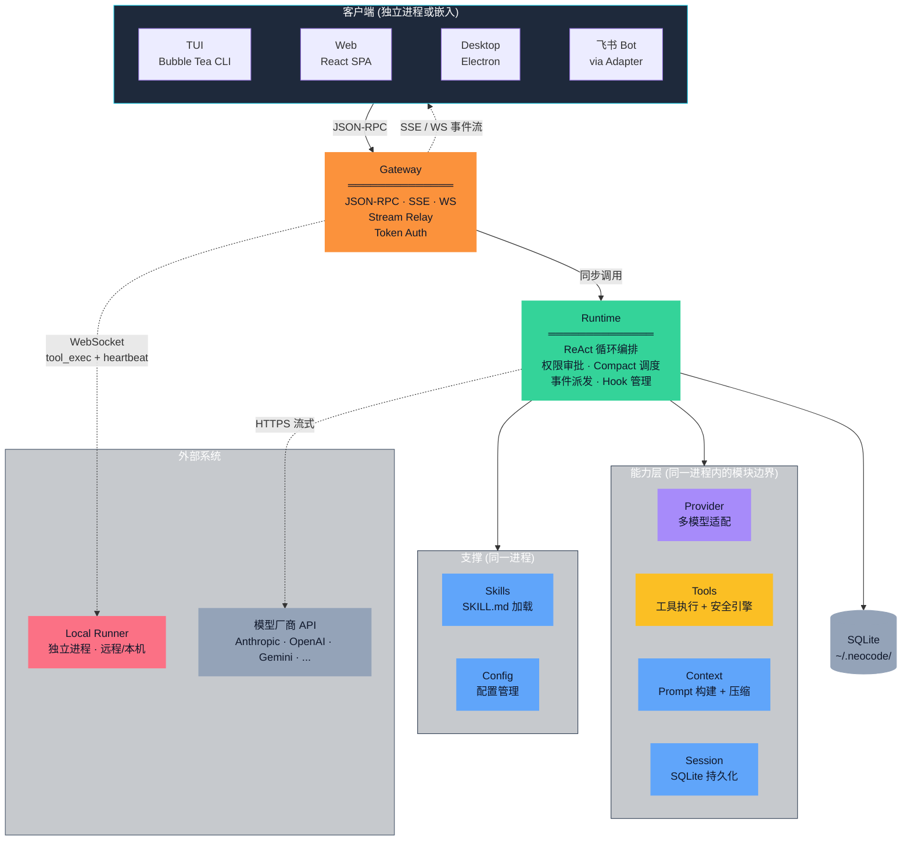
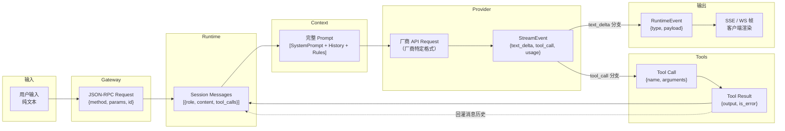

# 架构设计文档

**v4.0** | 2026-05-11 | 目标读者：团队成员、开源贡献者

读完本文，你将理解：
- 系统由哪些模块组成，整体框架是怎样的
- 为什么拆分为这些模块（而不是更多或更少）
- 每个模块的职责边界在哪里
- 系统的大致运行流程和数据流向

本文不描述具体实现细节——那些在 `docs/` 对应模块的设计文档中。

---

## 系统总概

NeoCode 是一个**本地优先、架构解耦、可被随时唤醒和编排的 AI Coding Agent 基础设施**。它以单一 Go 二进制分发，内部按职责拆分为九个模块，通过 Go interface 解耦。



上图九个模块分属四个层次：

| 层次 | 包含模块 | 定位 |
|------|----------|------|
| **客户端** | TUI、Web、Desktop、飞书 Bot | 用户交互界面，独立进程或嵌入 |
| **核心** | Gateway、Runtime | 系统的控制中枢——Gateway 是唯一的 RPC 边界，Runtime 是唯一的推理编排者 |
| **能力层** | Provider、Tools、Context、Session | Runtime 编排的对象，各自负责一类独立关注点 |
| **支撑** | Skills、Config | 被 Runtime 消费的配置与扩展资源 |

关键的控制方向：**客户端 → Gateway（唯一入口）→ Runtime（唯一编排者）→ 能力层（被编排者）**。这个单向依赖链是整篇文档的核心。

---

## 为什么分为这几个模块

在正式讲述模块职责之前，我们先明确**产品定位**：NeoCode 是一个**本地优先、架构解耦、可被随时唤醒和编排的 AI Coding Agent 基础设施**（详见[系统背景与目标](../product/positioning.md)）。

本节解释为什么这些关注点必须拆分为独立模块，而不是合并到一两个"大模块"里。拆分的标准是：**如果一个关注点有自己的数据结构、自己的变更节奏、自己的错误语义，它就值得成为一个独立模块。**

### Provider

我们要做一个 Agent，不是做一个底层模型。Agent 的价值在于推理编排、工具调用、安全控制——而不是绑定在某个模型厂商的 API 上。

如果模型协议差异（Anthropic 的 content blocks、OpenAI 的 messages、流式格式各不相同）散落在上层，那么每接入一个新模型，Runtime 和 Gateway 都要跟着改。Provider 将这些差异封装在一个只有两个方法的接口后面——`EstimateInputTokens` 和 `Generate`。上层看到的是统一的消息数组和流式事件 channel，不知道也不关心背后是哪个厂商。

当前已接入 Anthropic、OpenAI、Gemini、DeepSeek、MiniMax、Mimo，以及通过 OpenAI 兼容协议接入的 Qwen、GLM 等——每接入一家，Runtime 和 Gateway 零改动。

### Session

用户和 Agent 的对话可能持续数小时、跨越多天。关机后能找到之前的对话并继续，是基本需求。

如果每个模块各自管理自己关心的持久化状态（Runtime 管消息、Tools 管结果、Config 管偏好），数据一致性和事务边界无法保证。Session 模块将会话的所有持久化关注点——消息历史、会话头、Todo 列表、Token 统计——收敛到一套 SQLite schema 中。Compact 替换消息列表时，旧消息删除和新摘要插入在同一个 SQLite 事务中完成，不会出现"消息丢了但 SessionHead 没更新"的半状态。

### Context

每一次模型推理都需要一个完整的 Prompt——包含系统行为准则、工具能力列表、项目规则、当前任务状态、消息历史。这些内容来源不同、优先级不同、Token 预算约束不同。

如果 Runtime 自己拼接 Prompt，那么 Prompt 组装逻辑和推理循环逻辑会纠缠在一起。当我们需要调整 Prompt 结构（比如新增一个上下文源）或改变 Compact 策略（比如从 MicroCompact 切换到 Full Compact 的触发阈值），就必须修改推理循环。Context 模块将 Prompt 构建和上下文压缩作为独立关注点，Runtime 只需要说"给我当前会话的上下文"，不需要知道内部怎么拼。

### Tools

模型可以调用 `read_file`、`write_file`、`bash`、`web_fetch` 等工具。每一个工具的执行都涉及：参数校验、安全检查、执行、输出裁剪、结果格式化。

如果不收敛到一个模块，工具逻辑就会散落在 Runtime、Gateway、甚至 TUI 中。当我们需要新增一个工具或修改安全检查策略时，不知道要改几个地方。Tools 模块是所有可被模型调用的能力的**唯一注册和执行入口**——Security Engine 的四层安全检查在 Tools 内部，不可跳过，不可绕过。

### Config

系统在不同环境下有不同的行为参数——超时时间、模型名称、工作目录、Shell 类型。这些差异不应该硬编码在逻辑中。

Config 模块负责配置的加载、校验和注入。它保证非法配置在启动阶段就失败（而不是跑到一半才发现模型名写错了），并让其他模块通过统一的入口获取配置值而不关心来源（文件、环境变量、命令行参数）。

### Runtime

上面五个模块各自解决了独立关注点——但谁来把它们的调用顺序编排起来？谁来决定"现在该推理了""现在该执行工具了""现在该验收结果了"？

Runtime 是系统中唯一负责**编排**的模块。它运行 ReAct 循环：构建上下文 → 调用模型推理 → 解析输出 → 如果需要调工具，交给 Tools 执行并等待结果回灌 → 如果声称完成，交给 Verifier 验收 → 循环直到通过或终止。Runtime 不自己拼 Prompt、不自己执行工具、不自己适配模型协议——它只做编排。

### Gateway

TUI、Web、Desktop、飞书 Bot、CI 脚本——五种客户端类型，如果各自直连 Runtime，认证逻辑要写五遍，流式事件推送要写五遍，安全漏洞要修五处。

Gateway 将五条路径收敛为一条。它不做业务逻辑——只做三件事：**认证**（谁在请求）、**路由**（请求交给哪个 Runtime 操作）、**流中继**（把 Runtime 的异步事件推回给客户端）。TUI 和飞书 Bot 在 Gateway 看来是完全相同的 JSON-RPC 调用方。

### Runner

你在手机上通过飞书发指令"修一下 auth.go 的登录限流"，工位电脑需要执行代码修改。但工位电脑在 NAT/防火墙后面，没有公网 IP。

Runner 是系统中唯一可以运行在不同物理机上的组件。它**主动连接** Gateway（反向连接），不开放入站端口。Gateway 发给 Runner 的每个工具执行请求中携带 Capability Token——限定允许的工具列表、路径范围和有效期——确保远程执行不会变成通用 Shell。

### Client

用户的使用场景多样：在终端里边写代码边和 Agent 对话（TUI）、在浏览器里管理多个会话（Web）、在桌面应用中获得原生体验（Desktop）、在通勤时通过飞书快速查阅和修改代码（飞书 Bot）。

每个客户端是一个独立进程（或嵌入），通过同一套 JSON-RPC 2.0 协议接入 Gateway。客户端只负责交互和展示，不存业务状态。接入一个新客户端不需要修改 Gateway 或 Runtime 的任何代码。

---

## 设计约束

以下六条约束来自[系统背景与目标](../product/positioning.md)，是所有模块设计和演进的前置条件：

- **多模型可替换：** 用户自由选择和切换底层大模型，厂商差异不向上泄漏到 Runtime 或客户端。

- **本地优先：** 代码、会话、配置和密钥的全部生命周期停留在用户机器上。系统不依赖云端存储或远程控制面。

- **工具执行可控：** AI 拥有读写文件、执行 Shell 的权限——每次执行需可审计、可阻断、可回滚。Security Engine 是所有工具执行的必经路径。

- **Human-in-the-Loop：** 危险操作在执行前需经过人类审批。系统不假设审批发生在哪个客户端——TUI、Web、飞书都可以响应审批请求。

- **多端对等接入：** TUI、Web、Desktop、IM Bot、CI/CD 脚本都是对等的一等公民客户端。不存在"先 CLI 再适配 Web"的技术债。

- **单机零运维：** 单一二进制，零外部依赖（SQLite 通过纯 Go 实现编译进二进制），普通开发者可以直接"开箱即用"。

---

## 各模块的职责边界

以下定义每个模块**管什么**和**不管什么**。边界规则以 `AGENTS.md` 第 4 节为准，本节是这些规则的理论解释。

### Provider

| 管 | 不管 |
|----|------|
| 将统一的消息数组转换为厂商特定 API 请求格式 | 决定调用哪个模型（由 Config 和 Runtime 决定） |
| 解析厂商特定的流式响应，归一化为统一的 `StreamEvent` | 处理工具调用（StreamEvent 中的 tool_call 由 Runtime 转发给 Tools） |
| 估算输入 Token 数（供 Compact 决策使用） | 决定何时触发 Compact（由 Runtime 决定） |
| 将厂商错误（HTTP 4xx/5xx、认证失败、限流）映射为统一错误类型 | 重试策略（由 Runtime 根据错误类型决定） |

**接口契约：** `Provider` interface 仅两个方法——`EstimateInputTokens` 和 `Generate`。新增模型实现此接口即可接入，无需修改任何上层代码。

### Session

| 管 | 不管 |
|----|------|
| 会话的 CRUD（创建、查询、更新、删除） | 决定何时创建会话或追加消息（由 Runtime 决定） |
| 消息历史的持久化存储和查询 | 消息的语义解释（Content 是 opaque string） |
| Todo 列表、TaskState、激活的 Skills 的持久化 | Todo 的业务语义（由 Verifier 和 AcceptanceService 解释） |
| SQLite schema 演进和迁移 | 其他模块的存储（每个模块的数据通过 Session 的接口持久化，不自己开数据库连接） |
| 会话级写锁（sessionLock），保证同会话并发写串行化 | 跨会话的并发控制（不同会话天然并行，由 SQLite WAL 处理） |

**关键约束：** 只有 Session 模块可以直接访问 SQLite。其他模块需要持久化状态时，通过 Session 提供的接口操作，不直接打开数据库连接。

### Context

| 管 | 不管 |
|----|------|
| 按固定顺序组装 System Prompt（行为准则 → 工具列表 → 项目规则 → 任务状态 → Skills → 消息历史） | 决定 Prompt 中应该包含哪些工具（工具列表由 Tools 模块提供） |
| Compact 策略执行——MicroCompact（裁剪长 Tool Result）和 Full Compact（LLM 摘要历史） | 决定何时触发 Compact（由 Runtime 根据 Token 预算判断） |
| Token 预算核算和上下文窗口利用率监控 | 模型推理（由 Provider 执行） |
| 外部规则文件（`.agents/`、`CLAUDE.md`）的加载和注入 | 规则文件的语法和语义校验 |

**关键约束：** Context 的 Build 输入是 Session 对象，输出是 `[]Message`。Context 不持有任何运行时状态——每次 Build 是无状态的纯函数。

### Tools

| 管 | 不管 |
|----|------|
| 所有可被模型调用的工具的注册、Schema 定义和 Execute 实现 | 决定模型应该调用哪个工具（由模型自身决定） |
| Security Engine 的两阶段检查——PolicyEngine（allow/deny/ask 规则匹配）+ WorkspaceSandbox（路径边界校验） | 审批的 UI 交互（审批请求通过 Runtime 发出，由客户端展示） |
| 工具执行结果的格式化和裁剪 | 工具结果的语义解释（结果作为 Tool Result 回灌给模型） |
| MCP 外部工具的挂载和协议适配 | MCP 工具的权限（MCP 工具同样经过 Security Engine） |
| Checkpoint 创建（写操作前的自动文件快照） | Checkpoint 的存储（通过 Session 持久化） |

**关键约束：** 所有可被模型调用的能力必须在此注册。Runtime 和 TUI 中不允许内嵌工具逻辑。每次工具执行前必须经过 Security Engine，不可跳过。

### Config

| 管 | 不管 |
|----|------|
| 配置文件加载（`~/.neocode/config.yaml`）和多来源合并（文件 → 环境变量 → 命令行参数） | 运行时动态修改配置（配置在启动时加载，运行时不热更新） |
| 配置项校验——`selected_provider`、`current_model`、`workdir`、`shell` 在启动阶段校验 | 配置值的业务语义解释 |
| 环境变量名管理——配置中只存环境变量名（如 `ANTHROPIC_API_KEY`），不存明文密钥 | 密钥的生成、轮换或分发 |

**关键约束：** 非法配置应尽早失败（启动阶段），不让错误配置流入运行时。明文 API Key 不出现在配置文件、日志或传输中。

### Runtime

| 管 | 不管 |
|----|------|
| ReAct 循环编排——"构建上下文 → 推理 → 解析输出 → 调工具或验收 → 循环"的完整流程 | 具体的 Prompt 拼接（由 Context 负责） |
| 事件派发——将模型输出、工具结果、权限请求、最终结果转换为 `RuntimeEvent` 发给 Gateway | 事件的传输协议（由 Gateway 的 StreamRelay 负责） |
| Compact 调度——根据 Token 预算决定何时触发 Compact | Compact 的具体执行策略（由 Context 负责） |
| 停止条件判断——`max_turns` 上限、Token 预算耗尽、用户取消、验收通过/失败/无法完成 | 验收的具体执行（由 Verifier Engine 负责） |
| 权限审批流程——发出 `permission_request`，等待 `resolve_permission`，不阻塞其他 goroutine | 审批的 UI 展示（由客户端负责） |
| Hook 管理——在关键事件点（pre-tool-exec、post-tool-exec、pre-compact 等）执行注册的 Hook | Hook 的具体实现（由 Skills 或外部注册方提供） |

**关键约束：** Runtime 是系统中唯一能做编排决策的模块。Gateway 不编排、Tools 不编排、Context 不编排。如果一段逻辑在问"接下来该干什么"，它应该活在 Runtime 里。

### Gateway

| 管 | 不管 |
|----|------|
| 客户端认证——`gateway.authenticate` 分配 `subject_id`，本地模式自动授予 `local_admin` | 用户的业务权限（ACL 只控制 method × source 白名单，不控制数据级权限） |
| 协议路由——将 JSON-RPC 请求路由到对应的 Runtime 操作 | 业务逻辑——Gateway 是透明中继，不理解请求的业务含义 |
| StreamRelay——将 Runtime 事件按 Session/Run 过滤后广播到匹配的订阅连接 | 事件的产生和内容 |
| ACL——每个连接维护 method × source 白名单，未授权 method 直接拒绝 | 工具级权限（那是 Security Engine 的职责） |
| Runner 连接管理——接受 Runner 的 WebSocket 反向连接，管理心跳和 Capability Token 签发 | Runner 端的工具执行 |

**关键约束：** Gateway 是系统对外的唯一入口。所有客户端（包括 TUI）都必须通过 Gateway 接入。Gateway 不做业务逻辑——它应该薄到"几乎只是一个协议适配层"。

### Runner

| 管 | 不管 |
|----|------|
| 主动连接 Gateway（WebSocket 反向连接） | 决定何时连接（启动时自动连接，断开后自动重连） |
| 校验 Capability Token——验证 HMAC 签名、工具白名单、路径白名单、有效期 | Token 的签发（由 Gateway 签发） |
| 在本地执行 Gateway 发来的工具调用请求 | 工具的安全检查（Security Engine 在调用侧（Gateway 侧）已经执行过） |
| 心跳维持——每 10s 响应 Gateway 的 heartbeat | 连接的生命周期管理（由 Gateway 决定何时断开） |

**关键约束：** Runner 不开放任何入站端口。它只能被 Gateway 通过已有 WebSocket 连接"回调"，不能从外部直接访问。

### Client

| 管 | 不管 |
|----|------|
| 用户交互界面和展示 | 业务状态（会话、消息、Todo 都由 Runtime 管理） |
| JSON-RPC 2.0 请求发送和 SSE/WebSocket 事件消费 | 事件的产生（由 Runtime 产生，Gateway 中继） |
| 审批 UI——展示 `permission_request` 并收集用户决策 | 审批的裁决逻辑（allow/deny/ask 由 Security Engine 决定） |

**关键约束：** 客户端不存业务状态。会话列表、消息历史、Token 用量全部通过 Gateway RPC 查询。这使得切换客户端（比如从 TUI 换到 Web）时状态天然一致。

---

## 运行机制

以下从一个用户请求的完整生命周期，描述系统的运行流程和数据流向。

### 整体流程

1. **用户输入进入 Gateway。** 客户端（TUI/Web/Desktop/飞书）将用户输入封装为 JSON-RPC 请求，发给 Gateway。Gateway 做认证（确认 `subject_id`）和 ACL 检查（确认该连接有权调用 `gateway.run`）。

2. **Gateway 转发给 Runtime。** Gateway 将请求路由到目标 Session 的 Runtime 实例。如果是新会话，Runtime 先通过 Session 模块创建会话记录。

3. **Runtime 启动 ReAct 循环。** 每一轮循环：
   - **构建上下文：** 调用 Context.Build(session)，拿到包含 System Prompt、工具列表、项目规则、任务状态、消息历史的完整 Prompt。
   - **调用模型：** 将 Prompt 交给 Provider.Generate()，通过 Go channel 接收流式事件（`text_delta`、`tool_call`、`usage`）。
   - **处理输出：**
     - 如果是 `text_delta`（模型在"打字"）→ 包装为 `run_progress` 事件，发给 Gateway 的 StreamRelay，广播到客户端。
     - 如果是 `tool_call`（模型想执行工具）→ 交给 Tools 模块。Tools 先过 Security Engine（PolicyEngine + WorkspaceSandbox），根据结果直接执行 / 暂停等审批 / 拒绝。执行结果（或拒绝原因）作为 Tool Result 回灌到消息历史，进入下一轮循环。
     - 如果是 `end_turn`（模型声称完成）→ 进入验收流程。
   - **验收：** Completion Gate 检查 Todo 收敛状态，Verifier Gate 按 VerificationProfile 运行验证器（编译检查、测试运行、类型检查等），AcceptanceService 汇总裁决。通过则循环结束；存在可修复缺口则注入 continue hint 继续；失败则终止。

4. **结果回传。** Runtime 发出 `run_done` 事件，Gateway 的 StreamRelay 广播给所有订阅该 Session/Run 的客户端。客户端展示最终结果。

5. **中途可取消。** 客户端随时可以发送 `gateway.cancel`——Gateway 转发给 Runtime，Runtime 停止当前循环并发出 `run_done`。

### 数据流图



**关键变换点：**

| 阶段 | 数据形态变化 | 负责模块 |
|------|-------------|----------|
| 用户输入 → JSON-RPC | 纯文本被包装为 RPC 请求，注入 `subject_id` | Gateway |
| 消息历史 → 完整 Prompt | 离散的消息记录拼接为模型可消费的 Messages 数组，必要时触发 Compact | Context |
| 统一 Prompt → 厂商请求 | Messages 数组转换为厂商特定格式（Anthropic content blocks / OpenAI messages） | Provider |
| 厂商响应 → 统一事件 | 厂商的 SSE 格式被归一化为 `StreamEvent`（`text_delta` / `tool_call_start` / `usage`） | Provider |
| Tool Call → Tool Result | 经过 Security Engine 检查后执行，结果被格式化和裁剪 | Tools |
| RuntimeEvent → SSE/WS | 事件按 Session/Run 过滤后广播到匹配的订阅连接 | Gateway（StreamRelay） |

**两条数据回流路径：**
- **工具结果回灌：** Tool Result 写入 Session Messages，供下一轮推理使用。模型看到"刚才那个工具调用的结果是……"，据此决定下一步。
- **Compact 结果回写：** 压缩后的摘要替换原始消息历史，在同一个 SQLite 事务中完成旧消息删除和新摘要插入。

---

## 影响整体的几个架构决策

以下五条决策是 NeoCode 架构的基本形态。每条说明面对什么问题、选择了什么方案、付出了什么代价。

### Gateway 作为唯一 RPC 边界

**问题：** 五种客户端（TUI/Web/Desktop/飞书/CI 脚本）需要在不同场景下接入 Agent。如果各自直连 Runtime，认证要写五遍，流式推送要写五遍，安全漏洞要修五处。更严重的是——多端各自持有任务事实，会出现"TUI 显示运行中但飞书显示已完成"的状态分裂。

**方案：** Gateway 是系统对外的唯一入口。它不做业务逻辑——只做认证、路由和流中继。任何客户端只需实现 JSON-RPC 客户端 + SSE/WS 事件消费即可完整接入。TUI 和飞书 Bot 在 Gateway 视角是完全相同的调用方。

**代价：** Gateway 成为单点故障。缓解手段：本地模式下 TUI 自动拉起 Gateway 子进程（auto-spawn）；网络模式下可部署多个 Gateway 实例。

### Provider 插件化

**问题：** AI 模型市场快速变化，系统需要随时接入新模型而不修改上层代码。如果模型协议差异散落在 Runtime 或 Gateway 中，每接入一个新厂商就要改动系统的核心逻辑。

**方案：** `Provider` interface 仅定义两个方法——`EstimateInputTokens` 和 `Generate`。所有厂商特定的请求组装、流式格式解析、错误映射都在 Provider 实现内部消化。上层（Runtime、Gateway、TUI）看到的是统一的消息数组和 `StreamEvent` channel，不感知厂商差异。

**代价：** 无法深度利用特定厂商的高级特性（如 Anthropic 的 thinking 预算粒度控制、OpenAI 的 response_format）。这些特性需要抽象层先统一表达，当前暂不支持。

### 事件驱动的异步工具执行

**问题：** AI 推理是流式的——可能持续数十秒到数分钟，需要在中途暂停等待用户审批。同步调用会让客户端在推理完成前完全黑屏，无法实时看到模型"打字"，也无法中途取消。

**方案：** Provider 通过 Go channel 推送流式事件，Runtime 消费并转为统一的 `RuntimeEvent`，Gateway 的 StreamRelay 广播到订阅客户端。暂停-恢复语义通过事件实现——`permission_request` 事件发出后，Runtime 等待 `resolve_permission` 回复，不阻塞其他 goroutine。客户端随时可以通过 `gateway.cancel` 取消。

**代价：** 客户端需要支持 SSE 或 WebSocket 长连接，相比纯 HTTP 请求-响应多了连接管理的复杂度。事件顺序和幂等性需要 Runtime 和 Gateway 协同保证。

### 强边界单体架构

**问题：** 系统需要在单机单用户场景下运行，但也要支持多人并行开发、各模块独立演进。微服务架构在单机场景下引入序列化开销和运维复杂度——用户不应该为了跑一个本地 Agent 而启动 Docker Compose。

**方案：** 所有核心模块（Gateway、Runtime、Provider、Tools、Session、Context）运行在同一进程中，通过 Go interface 解耦。模块之间只依赖接口契约，不依赖具体实现。当某个模块确实需要跨越物理机时（如 Runner），才拆分为独立进程。这既不是微服务（单机开销不合理），也不是纯单体（直接调用会阻止独立演进）。

**代价：** 无法独立扩缩容单个模块（当前不需要）；模块间耦合只能靠接口契约约束，无法用网络隔离强制执行。团队需要纪律来维护边界。

### Runner 反向连接模型

**问题：** 用户希望在手机（通过飞书）或笔记本上远程操作工位电脑的代码库。但工位电脑在 NAT/防火墙后面，没有公网 IP。传统方案（开放 SSH 端口、VPN）要么不安全，要么操作门槛高。

**方案：** Runner 主动连接 Gateway（WebSocket 反向连接），不开放任何入站端口。Gateway 通过已有 WebSocket 连接向 Runner 下发工具执行请求，每个请求附带 Capability Token——一个 HMAC-SHA256 签名的令牌，限定允许的工具列表、路径范围和有效期。Runner 校验 Token 后才执行。

**代价：** 需要维持 WebSocket 长连接（心跳每 10s），断线需自动重连。Capability Token 的签发和校验增加了 Gateway 和 Runner 的复杂度。远程执行延迟高于本地执行。

---

## 附录 A：模块关系速查

```
Client ──JSON-RPC──▶ Gateway ──同步调用──▶ Runtime
                                            │
                    ┌───────────────────────┼───────────────────────┐
                    ▼                       ▼                       ▼
              Provider                Tools + Security           Context
              (模型推理)              (工具执行 + 安检)          (Prompt 构建)
                    │                       │                       │
                    └───────────────────────┼───────────────────────┘
                                            ▼
                                         Session
                                        (SQLite 持久化)

Gateway ◀──WebSocket── Runner (远程执行代理)
```

## 附录 B：相关文档

| 文档 | 路径 |
|------|------|
| 产品定位与竞品分析 | [../product/positioning.md](../product/positioning.md) |
| 系统背景与目标 | [../product/positioning.md](../product/positioning.md) |
| v3 架构文档（含详细流程） | [architecture-v3.md](architecture-v3.md) |
| 架构核心决策版 | [architecture-core.md](architecture-core.md) |
| Gateway RPC API 参考 | [../reference/gateway-rpc-api.md](../reference/gateway-rpc-api.md) |
| Gateway 详细设计 | [../gateway-detailed-design.md](../gateway-detailed-design.md) |
| Context Compact 策略 | [../context-compact.md](../context-compact.md) |
| Session 持久化设计 | [../session-persistence-design.md](../session-persistence-design.md) |
| Skills 系统设计 | [../skills-system-design.md](../skills-system-design.md) |
| 项目开发规范 | [../../AGENTS.md](../../AGENTS.md) |
