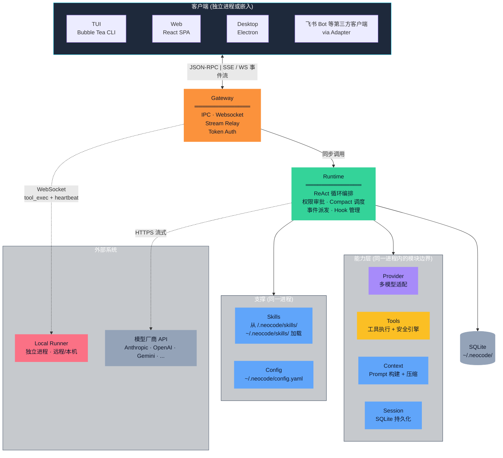
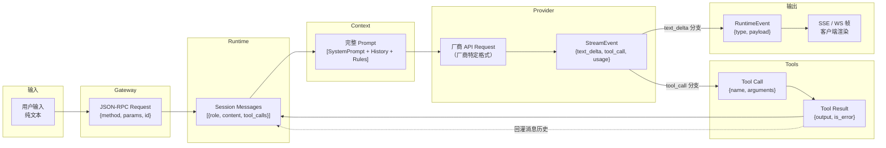

# 架构设计文档

**v4.0** | 2026-05-11 | 目标读者：团队成员、开源贡献者

读完本文，你将理解：
- 系统由哪些模块组成，整体框架是怎样的
- 为什么拆分为这些模块（而不是更多或更少）
- 每个模块的职责边界在哪里
- 系统的大致运行流程和数据流向

本文不描述具体实现细节——那些在 `docs/` 对应模块的设计文档中。

---

## 系统总概

NeoCode 是一个**本地优先、架构解耦、可被随时唤醒和编排的 AI Coding Agent 基础设施**。它以单一 Go 二进制分发，内部按职责拆分为九个模块，通过 Go interface 解耦。



上图九个模块分属四个层次：

| 层次 | 包含模块 | 定位 |
|------|----------|------|
| **客户端** | TUI、Web、Desktop、飞书 Bot | 用户交互界面，独立进程或嵌入 |
| **核心** | Gateway、Runtime | 系统的控制中枢——Gateway 是唯一的 RPC 边界，Runtime 是唯一的推理编排者 |
| **能力层** | Provider、Tools、Context、Session | Runtime 编排的对象，各自负责一类独立关注点 |
| **支撑** | Skills、Config | 被 Runtime 消费的配置与扩展资源 |

关键的控制方向：**客户端 → Gateway（唯一入口）→ Runtime（唯一编排者）→ 能力层（被编排者）**。这个单向依赖链是整篇文档的核心。

---

## 核心模块与职责边界

在正式讲述模块职责之前，我们先明确**产品定位**：NeoCode 是一个**本地优先、架构解耦、可被随时唤醒和编排的 AI Coding Agent 基础设施**（详见[系统背景与目标](../product/positioning.md)）。

本节将这 9 个模块的职责进行了严格界定。拆分的标准是：**如果一个关注点有自己的数据结构、自己的变更节奏、自己的错误语义，它就值得成为一个独立模块。**

### Provider
- **一句话定位**：模型协议适配器，负责抹平各大厂商 API 的异构差异。
- **设计初衷**：将厂商协议差异封装在底层，使得每接入一个新模型，上层（Runtime/Gateway）可实现零改动。

| 管什么（核心子功能） | 不管什么（职责边界） |
|--------------------|--------------------|
| 将系统统一消息转换为厂商特定请求格式 | 不决定调用哪个模型（由 Config 和 Runtime 决定） |
| 解析厂商流式响应，归一化为统一的 `StreamEvent` | 不处理工具调用逻辑（只负责解析出 ToolCall 交给上层） |
| 估算输入 Token 数供上下文截断使用 | 不决定重试策略和何时触发 Compact（由 Runtime 决定） |

### Session
- **一句话定位**：系统全局唯一的 SQLite 数据持久化枢纽。
- **设计初衷**：将会话、消息和任务状态的存储集中管理，确保读写都在同一个事务边界内，防止出现"断电后状态不一致"的半状态。

| 管什么（核心子功能） | 不管什么（职责边界） |
|--------------------|--------------------|
| 负责会话、消息历史、Todo 等领域模型的本地存储与读取 | 不解释消息的业务语义（只负责存取文本） |
| 提供基于 SQLite 的事务包装，处理数据库表结构升级迁移 | 不决定何时创建会话或追加消息（全由 Runtime 指挥） |
| 维护会话级写锁，保障同会话下的并发写入安全 | 不管跨会话并发（不同会话天然隔离，交由 SQLite 处理） |

### Context
- **一句话定位**：Prompt 与历史上下文的组装车间（无状态纯函数）。
- **设计初衷**：将复杂的上下文拼接逻辑与推理循环剥离开，让 Runtime 只需一句"给我当前上下文"，而不必关心怎么拼装。

| 管什么（核心子功能） | 不管什么（职责边界） |
|--------------------|--------------------|
| 按既定优先级组装包含系统规则、任务状态、工具列表的完整 Prompt | 不决定包含哪些工具（工具列表由 Tools 提供） |
| 负责执行上下文压缩（Compact）的具体操作逻辑（裁剪或交由模型总结） | 不决定何时触发 Compact（由 Runtime 根据 Token 预算判断） |
| 解析并注入外部规则文件（如 `CLAUDE.md`） | 绝对不持有任何运行时状态，即拿即用 |

### Tools
- **一句话定位**：模型能力的唯一执行网关与安全沙箱。
- **设计初衷**：收敛所有工具调用路径，确保模型对本地环境的每一次操作都强制经过多层安全检查，杜绝裸奔越权。

| 管什么（核心子功能） | 不管什么（职责边界） |
|--------------------|--------------------|
| 注册并暴露所有能力（读写文件、Bash、MCP 等）及其执行逻辑 | 不决定模型要调用哪个工具（由模型思考后决定） |
| 强制执行安全策略（拦截路径越界、匹配权限规则） | 不负责向用户展示审批弹窗（抛给 Runtime 去调度 UI） |
| 裁剪超长的工具输出，并在危险操作前自动创建文件快照（Checkpoint） | 不解析工具结果的业务语义（仅原样返回执行结果文本） |

### Config
- **一句话定位**：环境变量与静态配置的集中加载中心。
- **设计初衷**：统一处理多环境下的参数注入，并在启动阶段尽早拦截非法配置，避免运行时跑到一半才崩溃报错。

| 管什么（核心子功能） | 不管什么（职责边界） |
|--------------------|--------------------|
| 加载并合并多源配置（配置文件优先 → 环境变量 → 命令行参数） | 不支持运行时热更新（配置在启动时一次性加载定型） |
| 启动阶段对关键参数进行硬校验（如模型名、工作目录、Shell 类型） | 不解释配置项在实际运行中的具体业务语义 |
| 统一映射与管理环境变量名（保护隐私，绝不保存明文 API 密钥） | 不负责密钥的生成、轮换与分发流程 |

### Runtime
- **一句话定位**：系统的"核心大脑"与流程编排总监。
- **设计初衷**：集中处理 ReAct 循环、事件流调度和状态流转，其他模块都只是被它调用的"工具人"，保证控制流唯一。

| 管什么（核心子功能） | 不管什么（职责边界） |
|--------------------|--------------------|
| 编排核心 ReAct 循环（拿上下文 → 调模型 → 跑工具/验收） | 绝对不自己拼 Prompt、不亲自跑工具、不对接厂商 API |
| 监控并触发停止条件（Token 耗尽、超最大轮次、任务验收完毕） | 不直接介入代码验收的执行细节（由 Verifier 去做） |
| 派发统一事件流、调度权限审批的异步等待，并管理各种生命周期 Hook | 不管事件具体怎么通过网络传给客户端（那是 Gateway 的事） |

### Gateway
- **一句话定位**：唯一对外暴露的 RPC 通信网关与流量中继站。
- **设计初衷**：把不同客户端（TUI/Web/飞书）接入时的认证、路由和消息推送全盘接管，防止重复造轮子和安全漏洞。

| 管什么（核心子功能） | 不管什么（职责边界） |
|--------------------|--------------------|
| 拦截所有客户端连接，进行身份认证并分配 `subject_id` | 绝对不干涉核心业务逻辑（仅仅是个透明传声筒） |
| 将标准的 JSON-RPC 请求精准路由分发给对应的 Runtime 实例 | 不处理工具维度的数据级细粒度权限（交由安全引擎判断） |
| 维护 WebSocket/SSE 长连接，精准过滤并向对应客户端广播实时事件流 | 完全不产生任何业务状态数据 |

### Runner
- **一句话定位**：游离在主进程外的远端/本地命令执行死士。
- **设计初衷**：巧妙解决跨网穿透问题，当客户端与代码库不在同一台机器（且无公网 IP）时，通过反向连接安全执行操作。

| 管什么（核心子功能） | 不管什么（职责边界） |
|--------------------|--------------------|
| 以 WebSocket 反向连接方式，主动寻找并接入 Gateway，维持心跳 | 绝对不开放任何入站端口，只能被动接受 Gateway 差遣 |
| 严格校验 Gateway 签发的执行令牌（签名、白名单、有效期）防止越权 | 自己无权签发令牌，也不决定连接的生死存亡 |
| 在目标机器本地踏实执行工具调用请求 | 不负责前置的人工安全审批流程（服务端已经审过了） |

### Client
- **一句话定位**：只管纯粹展示与用户交互的无状态视图层。
- **设计初衷**：坚决剥离所有业务状态，确保用户不管是切到 TUI、Web 还是飞书，看到的系统状态永远是无缝一致的。

| 管什么（核心子功能） | 不管什么（职责边界） |
|--------------------|--------------------|
| 专心做好界面绘制、用户操作响应与人工审批弹窗 | 绝对不存储会话、历史消息或 Token 统计等任何持久化状态 |
| 发送 RPC 请求，并实时消费渲染后端推过来的流式事件 | 不参与任何业务上的裁决逻辑（如判定审批该过还是该拦） |
| 跨端操作时，实时刷新本地视图保持与后端的步调一致 | 完全由后端事件驱动，不主动捏造系统状态 |

---

## 设计约束

以下六条约束来自[系统背景与目标](../product/positioning.md)，是所有模块设计和演进的前置条件：

- **多模型可替换：** 用户自由选择和切换底层大模型，厂商差异不向上泄漏到 Runtime 或客户端。

- **本地优先：** 代码、会话、配置和密钥的全部生命周期停留在用户机器上。系统不依赖云端存储或远程控制面。

- **工具执行可控：** AI 拥有读写文件、执行 Shell 的权限——每次执行需可审计、可阻断、可回滚。Security Engine 是所有工具执行的必经路径。

- **Human-in-the-Loop：** 危险操作在执行前需经过人类审批。系统不假设审批发生在哪个客户端——TUI、Web、飞书都可以响应审批请求。

- **多端对等接入：** TUI、Web、Desktop、IM Bot、CI/CD 脚本都是对等的一等公民客户端。不存在"先 CLI 再适配 Web"的技术债。

- **单机零运维：** 单一二进制，零外部依赖（SQLite 通过纯 Go 实现编译进二进制），普通开发者可以直接"开箱即用"。


---

## 运行机制

以下从一个用户请求的完整生命周期，描述系统的运行流程和数据流向。

### 整体流程

1. **用户输入进入 Gateway。** 客户端（TUI/Web/Desktop/飞书）将用户输入封装为 JSON-RPC 请求，发给 Gateway。Gateway 做认证（确认 `subject_id`）和 ACL 检查（确认该连接有权调用 `gateway.run`）。

2. **Gateway 转发给 Runtime。** Gateway 将请求路由到目标 Session 的 Runtime 实例。如果是新会话，Runtime 先通过 Session 模块创建会话记录。

3. **Runtime 启动 ReAct 循环。** 每一轮循环：
   - **构建上下文：** 调用 Context.Build(session)，拿到包含 System Prompt、工具列表、项目规则、任务状态、消息历史的完整 Prompt。
   - **调用模型：** 将 Prompt 交给 Provider.Generate()，通过 Go channel 接收流式事件（`text_delta`、`tool_call`、`usage`）。
   - **处理输出：**
     - 如果是 `text_delta`（模型在"打字"）→ 包装为 `run_progress` 事件，发给 Gateway 的 StreamRelay，广播到客户端。
     - 如果是 `tool_call`（模型想执行工具）→ 交给 Tools 模块。Tools 先过 Security Engine（PolicyEngine + WorkspaceSandbox），根据结果直接执行 / 暂停等审批 / 拒绝。执行结果（或拒绝原因）作为 Tool Result 回灌到消息历史，进入下一轮循环。
     - 如果是 `end_turn`（模型声称完成）→ 进入验收流程。
   - **验收：** Completion Gate 检查 Todo 收敛状态，Verifier Gate 按 VerificationProfile 运行验证器（编译检查、测试运行、类型检查等），AcceptanceService 汇总裁决。通过则循环结束；存在可修复缺口则注入 continue hint 继续；失败则终止。

4. **结果回传。** Runtime 发出 `run_done` 事件，Gateway 的 StreamRelay 广播给所有订阅该 Session/Run 的客户端。客户端展示最终结果。

5. **中途可取消。** 客户端随时可以发送 `gateway.cancel`——Gateway 转发给 Runtime，Runtime 停止当前循环并发出 `run_done`。

### 数据流图



**关键变换点：**

| 阶段 | 数据形态变化 | 负责模块 |
|------|-------------|----------|
| 用户输入 → JSON-RPC | 纯文本被包装为 RPC 请求，注入 `subject_id` | Gateway |
| 消息历史 → 完整 Prompt | 离散的消息记录拼接为模型可消费的 Messages 数组，必要时触发 Compact | Context |
| 统一 Prompt → 厂商请求 | Messages 数组转换为厂商特定格式（Anthropic content blocks / OpenAI messages） | Provider |
| 厂商响应 → 统一事件 | 厂商的 SSE 格式被归一化为 `StreamEvent`（`text_delta` / `tool_call_start` / `usage`） | Provider |
| Tool Call → Tool Result | 经过 Security Engine 检查后执行，结果被格式化和裁剪 | Tools |
| RuntimeEvent → SSE/WS | 事件按 Session/Run 过滤后广播到匹配的订阅连接 | Gateway（StreamRelay） |

**两条数据回流路径：**
- **工具结果回灌：** Tool Result 写入 Session Messages，供下一轮推理使用。模型看到"刚才那个工具调用的结果是……"，据此决定下一步。
- **Compact 结果回写：** 压缩后的摘要替换原始消息历史，在同一个 SQLite 事务中完成旧消息删除和新摘要插入。

---

## 影响整体的几个架构决策

以下五条决策是 NeoCode 架构的基本形态。每条说明面对什么问题、选择了什么方案、付出了什么代价。

### Gateway 作为唯一 RPC 边界

**问题：** 五种客户端（TUI/Web/Desktop/飞书/CI 脚本）需要在不同场景下接入 Agent。如果各自直连 Runtime，认证要写五遍，流式推送要写五遍，安全漏洞要修五处。更严重的是——多端各自持有任务事实，会出现"TUI 显示运行中但飞书显示已完成"的状态分裂。

**方案：** Gateway 是系统对外的唯一入口。它不做业务逻辑——只做认证、路由和流中继。任何客户端只需实现 JSON-RPC 客户端 + SSE/WS 事件消费即可完整接入。TUI 和飞书 Bot 在 Gateway 视角是完全相同的调用方。

**代价：** Gateway 成为单点故障。缓解手段：本地模式下 TUI 自动拉起 Gateway 子进程（auto-spawn）；网络模式下可部署多个 Gateway 实例。

### Provider 插件化

**问题：** AI 模型市场快速变化，系统需要随时接入新模型而不修改上层代码。如果模型协议差异散落在 Runtime 或 Gateway 中，每接入一个新厂商就要改动系统的核心逻辑。

**方案：** `Provider` interface 仅定义两个方法——`EstimateInputTokens` 和 `Generate`。所有厂商特定的请求组装、流式格式解析、错误映射都在 Provider 实现内部消化。上层（Runtime、Gateway、TUI）看到的是统一的消息数组和 `StreamEvent` channel，不感知厂商差异。

**代价：** 无法深度利用特定厂商的高级特性（如 Anthropic 的 thinking 预算粒度控制、OpenAI 的 response_format）。这些特性需要抽象层先统一表达，当前暂不支持。

### 事件驱动的异步工具执行

**问题：** AI 推理是流式的——可能持续数十秒到数分钟，需要在中途暂停等待用户审批。同步调用会让客户端在推理完成前完全黑屏，无法实时看到模型"打字"，也无法中途取消。

**方案：** Provider 通过 Go channel 推送流式事件，Runtime 消费并转为统一的 `RuntimeEvent`，Gateway 的 StreamRelay 广播到订阅客户端。暂停-恢复语义通过事件实现——`permission_request` 事件发出后，Runtime 等待 `resolve_permission` 回复，不阻塞其他 goroutine。客户端随时可以通过 `gateway.cancel` 取消。

**代价：** 客户端需要支持 SSE 或 WebSocket 长连接，相比纯 HTTP 请求-响应多了连接管理的复杂度。事件顺序和幂等性需要 Runtime 和 Gateway 协同保证。

### 强边界单体架构

**问题：** 系统需要在单机单用户场景下运行，但也要支持多人并行开发、各模块独立演进。微服务架构在单机场景下引入序列化开销和运维复杂度——用户不应该为了跑一个本地 Agent 而启动 Docker Compose。

**方案：** 所有核心模块（Gateway、Runtime、Provider、Tools、Session、Context）运行在同一进程中，通过 Go interface 解耦。模块之间只依赖接口契约，不依赖具体实现。当某个模块确实需要跨越物理机时（如 Runner），才拆分为独立进程。这既不是微服务（单机开销不合理），也不是纯单体（直接调用会阻止独立演进）。

**代价：** 无法独立扩缩容单个模块（当前不需要）；模块间耦合只能靠接口契约约束，无法用网络隔离强制执行。团队需要纪律来维护边界。

### Runner 反向连接模型

**问题：** 用户希望在手机（通过飞书）或笔记本上远程操作工位电脑的代码库。但工位电脑在 NAT/防火墙后面，没有公网 IP。传统方案（开放 SSH 端口、VPN）要么不安全，要么操作门槛高。

**方案：** Runner 主动连接 Gateway（WebSocket 反向连接），不开放任何入站端口。Gateway 通过已有 WebSocket 连接向 Runner 下发工具执行请求，每个请求附带 Capability Token——一个 HMAC-SHA256 签名的令牌，限定允许的工具列表、路径范围和有效期。Runner 校验 Token 后才执行。

**代价：** 需要维持 WebSocket 长连接（心跳每 10s），断线需自动重连。Capability Token 的签发和校验增加了 Gateway 和 Runner 的复杂度。远程执行延迟高于本地执行。

---

## 附录 A：模块关系速查

```
Client ──JSON-RPC──▶ Gateway ──同步调用──▶ Runtime
                                            │
                    ┌───────────────────────┼───────────────────────┐
                    ▼                       ▼                       ▼
              Provider                Tools + Security           Context
              (模型推理)              (工具执行 + 安检)          (Prompt 构建)
                    │                       │                       │
                    └───────────────────────┼───────────────────────┘
                                            ▼
                                         Session
                                        (SQLite 持久化)

Gateway ◀──WebSocket── Runner (远程执行代理)
```

## 附录 B：相关文档

| 文档 | 路径 |
|------|------|
| 产品定位与竞品分析 | [../product/positioning.md](../product/positioning.md) |
| 系统背景与目标 | [../product/positioning.md](../product/positioning.md) |
| v3 架构文档（含详细流程） | [architecture-v3.md](architecture-v3.md) |
| 架构核心决策版 | [architecture-core.md](architecture-core.md) |
| Gateway RPC API 参考 | [../reference/gateway-rpc-api.md](../reference/gateway-rpc-api.md) |
| Gateway 详细设计 | [../gateway-detailed-design.md](../gateway-detailed-design.md) |
| Context Compact 策略 | [../context-compact.md](../context-compact.md) |
| Session 持久化设计 | [../session-persistence-design.md](../session-persistence-design.md) |
| Skills 系统设计 | [../skills-system-design.md](../skills-system-design.md) |
| 项目开发规范 | [../../AGENTS.md](../../AGENTS.md) |
