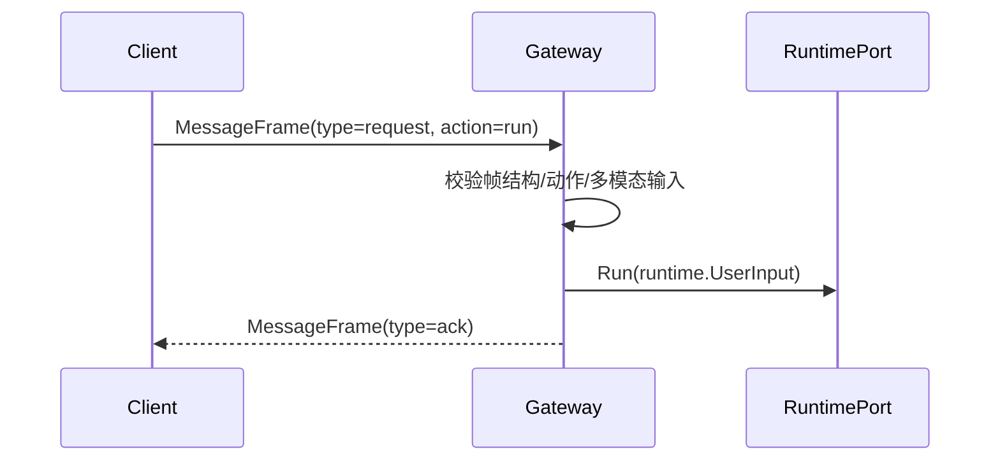
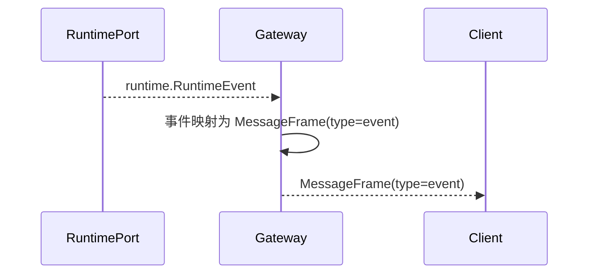

# Gateway 模块设计与接口文档

> 文档版本：v3.0
> 文档定位：详细设计文档（LLD）+ 接口文档（API/Contract）

## 规范词约定

- `MUST`：必须满足的架构契约，违反会破坏入口一致性与联调稳定性。
- `SHOULD`：强烈建议遵循，若例外必须记录原因。
- `MAY`：可选增强能力。

## 1. 详细设计（LLD）

### 1.1 目的与范围

Gateway 是系统唯一协议入口，负责把 `Client -> Gateway -> Runtime` 的链路固化为统一通信模型。

Gateway 模块 MUST 覆盖：

- HTTP/WS 协议接入、连接生命周期管理。
- 请求帧校验与动作分发（run/compact/cancel/session 操作）。
- 与 Runtime 的类型映射和错误归一。
- Runtime 事件到客户端帧的回推。

Gateway 模块 MUST NOT 覆盖：

- 业务编排与终态门禁（由 Runtime 负责）。
- 模型调用与工具执行（由 Provider/Tools 负责）。
- 会话存储实现（由 Session 负责）。

### 1.2 架构模式

- 模式：协议适配器 + 连接管理器 + 运行时桥接口。
- 主契约：`gateway.Gateway`。
- 下游端口：`gateway.RuntimePort`。
- 协议帧：`gateway.MessageFrame`。

### 1.3 核心流程

#### 1.3.1 客户端请求到 Runtime 的映射流程



#### 1.3.2 Runtime 事件回推流程



### 1.4 多模态输入约束

- 网关请求帧 MUST 支持 `input_text` 与 `input_parts` 并存。
- `input_parts` MUST 采用 `provider.MessagePart` 语义，支持文本与图片等非文本输入。
- 当客户端请求的输入模态不合法时，Gateway MUST 返回 `type=error` 帧并给出稳定错误码。
- Gateway SHOULD 在入站阶段执行基础大小限制与格式校验，避免将无效大负载透传到 Runtime。

### 1.5 边界与职责约束

- 上游：CLI、TUI、Web/Desktop。
- 下游：RuntimePort。
- 边界约束：Gateway 只做协议适配和连接管理，不承载业务状态机。

### 1.6 非功能约束

- 并发：MUST 支持多连接并发。
- 可观测性：SHOULD 记录 `request_id`、`run_id`、`session_id`、`action`。
- 稳定性：MUST 保持入站校验失败与下游错误的可判定错误码。

## 2. 接口文档（API/Contract）

### 2.1 公共规范

- 网关主入口 MUST 通过 `Gateway.Serve(ctx, runtimePort)` 启动。
- 所有客户端消息 MUST 映射为 `MessageFrame`。
- 网关与运行时边界 MUST 通过 `RuntimePort` 契约交互。

### 2.2 接口目录

| 接口 | 职责 |
|---|---|
| `Gateway` | 网关主契约（服务生命周期 + 运行时桥接） |
| `RuntimePort` | 网关下游端口契约（run/compact/cancel/events/session） |

### 2.3 关键类型目录

| 类型 | 说明 |
|---|---|
| `MessageFrame` | 网关统一请求/事件/错误帧 |
| `FrameType` | 帧类型枚举（request/event/error/ack） |
| `FrameAction` | 动作枚举（run/compact/cancel/list/load/set_workdir） |
| `FrameError` | 错误帧负载 |

### 2.4 JSON 示例

#### 2.4.1 多模态运行请求帧

```json
{
  "type": "request",
  "action": "run",
  "request_id": "req_001",
  "session_id": "sess_abc",
  "input_text": "请分析这张图",
  "input_parts": [
    {"type": "text", "text": "请先读取图片中的文字"},
    {
      "type": "image",
      "media": {
        "uri": "file:///workspace/assets/screen.png",
        "mime_type": "image/png",
        "file_name": "screen.png"
      }
    }
  ],
  "workdir": "/workspace/project"
}
```

#### 2.4.2 运行事件帧

```json
{
  "type": "event",
  "action": "run",
  "run_id": "run_123",
  "session_id": "sess_abc",
  "payload": {
    "event_type": "run_progress",
    "message": "receiving text delta"
  }
}
```

#### 2.4.3 校验失败错误帧

```json
{
  "type": "error",
  "action": "run",
  "request_id": "req_001",
  "error": {
    "code": "invalid_multimodal_payload",
    "message": "input_parts contains unsupported media type"
  }
}
```

### 2.5 变更规则

- 新增帧字段 MUST 向后兼容。
- 既有 `FrameType`/`FrameAction` 语义 MUST 保持稳定。
- 下游 `RuntimePort` 方法签名变更 SHOULD 通过版本化窗口过渡。

## 3. 评审检查清单

- 是否明确 `Gateway` 为唯一主契约锚点。
- 是否包含双向核心流程图（请求映射 + 事件回推）。
- 是否包含多模态输入帧示例（文本 + 图片）。
- 是否明确 Gateway 不承载编排和工具执行职责。
- README 类型名是否与 `gateway/interface.go` 一致。
